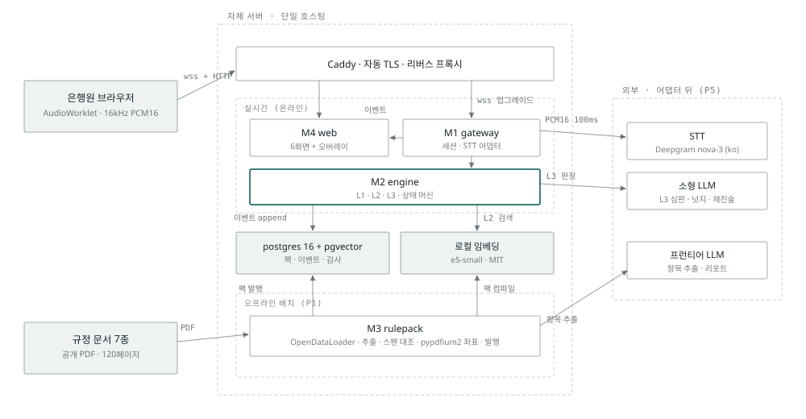
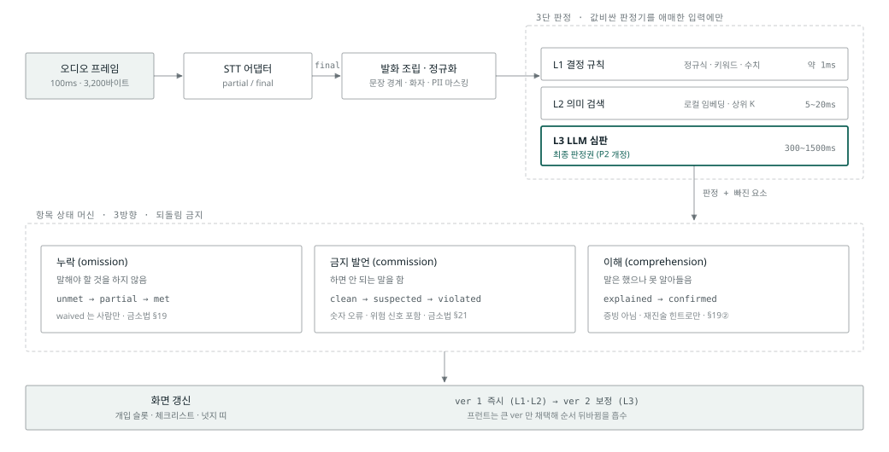
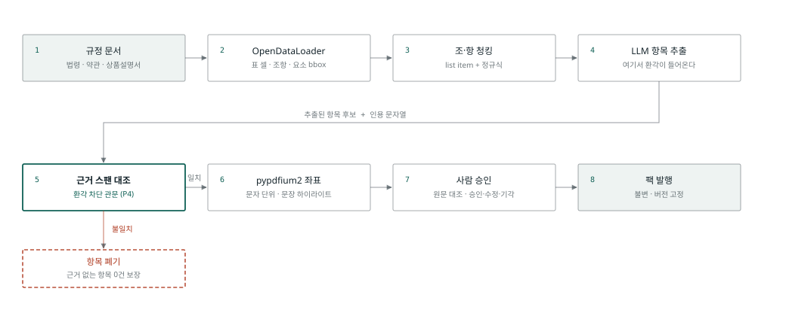
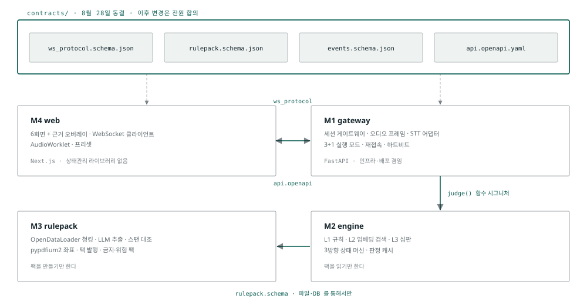

# 말틈 · 핵심 기획안 v0.5

> **용도** 팀 공유 컨텍스트 + 제출 문서(기획서·기능명세서)의 원본
> **갱신** 2026-08-26 · **상태** 현장 검증 반영 + 타겟 시나리오 변경판(예적금 해지·주담대). 인터뷰 원자료는 `현장검증_인터뷰정리.md`, 상세 검토 이력은 `90_아카이브/핵심기획안_v0.2_상세검토판.md`

---

## 0. 문서 안내

### 0.1 대회 요건 (요강 원문 기준, 2026-08-23 확인)

출처: [DAKER 공모전 페이지](https://daker.ai/public/hackathons/2026-finance-ai-challenge)

| 항목 | 내용 |
| --- | --- |
| 제출 마감 | 2026-09-07(월) 10:00 |
| **배포 URL 접속 기간** | **2026-09-07(월) 11:00 ~ 09-11(금) 23:59.** 요강 원문: "접근 불가 시 결격 사유에 해당" |
| 제출물 | 기획서 **PDF** + 기능명세서 **PDF** + 웹서비스 URL |
| 예선(본선 심사) | 내부 비공개 심사위원단 평가 100%. 기준은 "**주제 적합성, 부적격 여부 평가 등**" |
| 발표 심사 | 상위 **11팀 내외** · 10-13(화) · PT 15분 + 질의 5분 · **PDF 만 허용, PPT 불허** |
| 최종 산출물 | 10-08(목) 23:59 까지 발표자료 PDF + 소스코드 ZIP |
| 팀 · 데이터 | 최대 4인 · 제공 데이터 없음(직접 확보) |
| 참가 규모 · 상금 | 989팀 신청 · 총 3,500만원 (대상 2,000만원) |

### 0.2 담당 분리

| 영역 | 담당 | 이 문서에서 |
| --- | --- | --- |
| **설득력**: 문제 근거, 이점, 기대 효과, 정량화, 약점 방어 | R5 전담 | 3 · 4 · 6장은 **초안.** 확정은 R5 |
| **기술 설계**: 유저 플로우, 아키텍처, 화면, 스택, 일정, 분업 | 이 문서의 주 범위 | 7~17장이 본체 |

### 0.3 읽는 순서

처음 읽는 사람: **1장** (무엇인지) → **0.1** (지켜야 하는 것) → **7~8장** (무엇을 만드는지) → **17장** (내 모듈) → **15장** (언제까지) → **11장** (어떻게 돌아가는지) → **19장** (안 정한 것).

---

## 1. 한 장 요약

**금융상품 대면 상담에서 판매자가 말로 해야 하는 설명의무를, 상담 중에 실시간으로 추적·검증하고 이행 증빙을 발행하는 AI 컴플라이언스 에이전트.**

| 축 | 답 |
| --- | --- |
| 1차 사용자 | 은행 영업점 창구 직원 (첫 적용지) |
| 2차 수혜자 | 대면 상담에 의존하는 금융소비자, 특히 고령·금융취약계층 |
| 채널 | 오프라인 영업점 창구. 채널·업권 중립 설계 |
| 무엇을 | 필수 고지 **누락** · 하면 안 되는 **금지 발언** · **틀린 숫자** · **위험 신호**를 실시간으로 짚고, 물으면 근거 있는 답을 주고, 종료 시 증빙을 발행. 체크리스트는 사람이 만들지 않고 법령·약관·상품설명서에서 자동 추출 |
| 왜 지금 | 금소법 6대 판매원칙 시행 중이나 창구의 **구두 설명**은 이행 여부를 확인·집계할 수단이 없음 |
| 왜 다른가 | 사후 샘플링이 아니라 **상담 중 전수**. 사내 FAQ 가 아니라 **법령 원문 스팬 근거**. 불확실하면 미고지로 남기는 **fail-safe** |

**한 문장 피치**
> "모바일 앱에서는 코드가 고지를 강제합니다. 창구에서는 사람의 기억에 맡기고 있습니다. 말틈은 그 기억을 대신합니다."

**AX 인과** (R9 주제 적합성 대응의 골격, 담당 R5)
> 은행원의 정확한 상담 지원 → 고객이 상품을 정확히 이해 + 상담 왕복 감소 → 상담 시간 단축 → 창구 대기 시간 단축. **소비자와 은행이 동시에 이득이라 도입 유인이 실재한다.**

---

## 2. 서비스명 [첨부1-1]

**말틈. 확정 (2026-08-27 팀 결정. 이전 이름 '귀띔'에서 개명).**

- 상담의 말 사이에 생기는 틈(놓친 고지 · 잘못 말한 숫자 · 위험 신호)을 실시간으로 짚는 제품 동작과 닿는 이름 `[추론]`. 공식 작명 취지 한 줄은 R5 확정 시 보강 `[확인]`
- 감시가 아니라 조력 프레임(P6) 유지. 채널·업권이 이름에 박히지 않아 확장 시 개명 부담 없음
- 도메인·리포지토리 등 기술 식별자는 로마자 `malteum` (팀 레포명과 일치). 브랜드 표기에는 쓰지 않음

---

## 3. 문제 정의 · 제안 배경 [첨부1-3] `R5 초안`

| 구분 | 대상 |
| --- | --- |
| 1차 사용자 | 창구 직원, 특히 경력 3년 미만 |
| 2차 수혜자 | 고령층·금융취약계층·외국인 |
| 채널 | 오프라인 영업점 창구 (첫 배치 지점) |

**왜 창구인가 (논거 4개)**

1. 앱의 고지는 코드가 강제하지만 창구의 고지는 사람의 말. 같은 법적 의무인데 통제 수준이 극단적으로 다름
2. 금소법 §19②는 이해 확인 수단으로 서명·기명날인·**녹취**를 인정하나, 녹취는 검색·집계 가능한 증빙이 아님. 그리고 설명의무 위반의 **입증책임은 판매업자(은행)에 있음**(§44②)
3. **예금·대출은 판매직원 서명 예외 대상**(금융위 설명의무 가이드라인). 구두 설명 검증 수단이 법적으로 가장 부실한 영역
4. 기존 보이스피싱 방어 장치(지연이체·입금계좌지정)는 **창구거래 미적용**(금융위 대책 문서 원문). ⑦ 위험 신호가 이 공백을 메움

**문제의 구조**: 규정→사람(체크리스트를 사람이 만들고 개정 반영이 늦음) / 사람→상담(기억으로 수행, 누락 발생 사실을 아무도 모름) / 상담→증빙(재청취 없이는 소명 불가, 이행률 통계 부재).

`[확인]` 정량 근거(제재 수준·분쟁 통계·상담 규모)는 R5 담당. 가장 강한 카드는 **우리 파이프라인이 문서에서 뽑은 항목 수 실측치**.

### 3.1 현장 검증 (인터뷰 2회, 2026-08 수행)

새마을금고 재직자(경력 2년, 수신 → 여신) 1인을 두 차례 인터뷰했다. **표본 1명·1개 지점이므로** 규제·법령에서 오는 사실만 일반화하고, 지점 관행은 그 지점의 사정으로만 쓴다. 원자료: `현장검증_인터뷰정리.md`

| 확인된 것 | 인터뷰 진술 | 설계에 닿는 곳 |
| --- | --- | --- |
| 1차 사용자 가설 | "신규 직원들한테는 이게 도움이 엄청 많이 될 거 아니야" | 3장 대상 정의 유지 |
| 화면 비노출 | "안 보이는 게 맞는 것 같아요. 이게 은행을 돕는 거라서" | 8.2 UI 원칙 유지 |
| 수신의 아픈 곳 | 중도해지 이자율이 감사 지적 대상 (응답자 직접 경험) | 9장 시연 A 재배치 |
| 여신의 아픈 곳 | 신입의 자필 서명 누락. 체크리스트 용처로 응답자가 유일하게 자발 언급 | 19장 검토 후보 F2 |
| 유일한 자발 요청 | 규정 질의 도구. "그게 나도 필요해" (본부 상담 창구가 답을 못 주는 경우 있음) | 19장 검토 후보 F1 |
| 창구 전산 환경 | 수신 PC 1대 사내망 전용 · 여신 PC 2대(사내망+외부망, 생성형 AI 차단) | 11.5 배치 형상 |
| 규정 전달 경로 | 금융위·행안부 → 중앙회 문서 하달 → 지점 게시판·법규집 (개정 다음 날 게시) | 규정 개정 감시(7.2 확정) |
| 녹음 수용성 | 1차 긍정("고지만 하면") ↔ 2차 관리자급 부정("보수적이라 받아줄 곳이 있을지") | 16장 리스크 9 |

인터뷰가 뒤집은 것도 있다. 시연 A 의 누락 항목으로 심어 둔 예금자보호 한도는 현업 체감 중요도가 낮았고, 금융위 설명의무 가이드라인 p.13 도 이를 "소비자가 설명서에서 확인하면 스스로 이해 가능한 사항"의 예시로 들어 설명 깊이 조정을 허용한다. 반면 중도해지는 감사에서 실제로 지적된 항목이고, 주담대는 현업이 꼽은 주력 상품이다. 이 확인이 **타겟 시나리오 자체를 예적금 해지·주담대로 바꾸는 결정**(2026-08-26, 9장)으로 이어졌다.

---

## 4. 서비스 컨셉 · 차별성 [첨부1-4] `R5 초안`

> **"규정 문서를 실행 가능한 체크리스트로 컴파일하고, 상담 발화를 그 체크리스트에 실시간으로 대조한다."**

### 4.1 3방향 검증

| 방향 | 무엇 | 법적 근거 | 상태값 |
| --- | --- | --- | --- |
| **누락** (omission) | 말해야 하는 것을 하지 않음 | 금소법 §19 | `unmet → partial → met` (waived 는 사람만) |
| **금지 발언** (commission) | 하면 안 되는 말·틀린 숫자·위험 신호 | 금소법 §21·§22, 전자금융거래법 §6 | `clean → suspected → violated` |
| **이해** (comprehension) | 말은 했으나 고객이 못 알아들음 | 금소법 §19② | `explained → confirmed`. **증빙이 아니라 재진술 힌트로만** 사용(신뢰도 낮은 신호를 증빙으로 쓰면 P3 위반) |

### 4.2 차별성

| 비교군 | 한계 | 말틈의 차이 |
| --- | --- | --- |
| 콜센터 STT·상담품질(QA) | 사후 · 샘플링 · 콜 한정 | **대면 · 상담 중 · 전수** |
| 실시간 상담 어시스턴트 | 근거가 사내 FAQ | **법령 원문 스팬 + 인용**. 리포트가 곧 소명 자료 |
| 전자문서 동의·서명 | 구두 설명 여부를 모름 | 발화 자체를 항목 단위 증빙으로 구조화 |
| 규정 검색 챗봇(RAG) | 물어야 작동 | 묻지 않아도 놓친 것을 먼저 알림 |

### 4.3 독창성

1. **체크리스트를 사람이 만들지 않는다**: 근거 스팬 문자열 대조로 환각 차단(P4) 후 사람 승인·버전 발행
2. **누락·금지·이해를 함께 본다**: 법 문언 구조에 1:1 대응
3. **말이 증빙이 된다**: append-only 이벤트 + 근거 스팬 + `pack_version` 고정으로 과거 판정 재현
4. **틀리는 방향을 고정했다**: 불확실하면 미고지 유지(P3). met → unmet 되돌림 금지

---

## 5. 활용 데이터 · 생성형 AI [첨부1-5]

### 5.1 데이터 3종

| 데이터 | 출처 | 활용 |
| --- | --- | --- |
| 규정·법령 원문 | 국가법령정보센터 · 금융위 가이드라인 · 은행연합회 약관 · 은행 공시 상품설명서. **8종 118페이지 확보 완료**(`03_규정문서/MANIFEST.md`. 08 은 웹 공시 스냅샷) | OpenDataLoader 구조 추출 → 조·항 청킹 → 항목 추출 → 근거 스팬 대조 → pypdfium2 좌표 → 임베딩(pgvector) |
| 상담 음성 | 시연용 TTS + 사람 녹음 1건 / 라이브 마이크 | 실시간 STT → 3방향 판정. **원본 오디오 비저장** |
| 판정·발화 이벤트 | 시스템 생성 (append-only) | 화면 · 재접속 복구 · 리포트 · 감사 · trace 재생 |

### 5.2 생성형 AI 역할 5개

| # | 지점 | 시간축 | 입력 → 출력 |
| --- | --- | --- | --- |
| 1 | **규정 항목 추출** (주 워크로드) | 오프라인 | 문서 청크 → 항목 코드·요건 요소·타입(필수/금지)·법적 근거·원문 인용 스팬 (구조적 출력) |
| 2 | **3방향 판정** (L3 심판, 최종 판정권) | 실시간 | 확정 발화 + 후보 항목 → 상태 + 빠진 요소 |
| 3 | **⑥-B 즉석 재진술** | 실시간 | 직전 은행원 발화 → 같은 내용의 쉬운 문장. **새 정보 생성 금지**, ⑤ 로 숫자 검증 |
| 4 | **넛지·역질문 답변** | 실시간 | 미고지 항목·고객 질문 → 은행원에게 보일 한 줄 (근거 인용 필수) |
| 5 | **리포트 서술** | 오프라인 | 세션 이벤트 → 이행 요약·미고지 사유 |

L1(정규식)·L2(임베딩 검색)는 지연·비용 프리필터. **최종 판정권은 L3.** 재현성은 이벤트 저장·판정 캐시·trace 모드로 확보(P2).

### 5.3 개인정보 · 민감정보 [첨부2-4 대응]

| 항목 | 방침 |
| --- | --- |
| 실제 개인정보 | **수집 0건.** 시연은 전부 가상 인물 |
| 원본 오디오 · 중간 전사 | **비저장.** 확정 발화만 PII 마스킹(주민번호·계좌·전화·카드 정규식) 후 저장 |
| 외부 전송 | 심사 시연 구성에서만 STT·LLM 이 외부 API 를 경유하며 화면·문서에 명시. STT 는 요청 단위 학습 옵트아웃(`mip_opt_out`) 기본값. 제품 배치는 내부망 + 온프렘이 전제라 외부 전송 자체가 없음(11.5) |
| 녹음 고지 | 라이브 모드에 "녹음·분석 중" 상시 표시 |

---

## 6. 기대 효과 [첨부1-6] `R5 초안`

| 주체 | 혜택 |
| --- | --- |
| 은행원 | 암기 부담 제거 · 신입 온보딩 단축 · **"내 상담은 규정을 지켰다"는 방어권**(입증책임이 은행에 있으므로 기록이 은행원을 지킴) |
| 금융소비자 | 누락 없는 안내 + 쉬운 재설명. 상담 왕복 감소 → 대기 시간 단축 |
| 금융회사 | 제재·분쟁 리스크 감소 · 상담품질 전수 관리 · 규정 개정 시 팩 재발행으로 동시 반영 |

**확장**: 상담 유형은 규정 팩 추가만으로(코드 변경 0) · 채널은 어댑터 교체로 콜센터·화상·앱 채팅 · 업권은 증권(적합성·설명)·보험(모집 설명의무)·카드 · 금융 외는 의료 설명동의·부동산 중개 설명의무 등 설명의무가 존재하는 모든 대면 절차.

여신 유형 구조(신용·주담대·땅 담보·건물 담보·사업자·법인)가 팩 추가만으로 늘어나는 데이터 확장 형태임이 현장에서 확인됐다. 주담대("예적금이랑 주담대가 은행 벌이 수단" `[I2]`)를 시연에 채택했고(9장), 나머지 유형이 그 확장 경로다.

### 6.1 채택 경로

인터뷰 기준 도입 결정권은 현장이 아니라 **지역본부·본부에 있다.** 현장 직원의 저항은 크지 않을 것으로 응답자가 판단했고, 단말 구매 부담도 낮게 봤다. 따라서 설득 대상이 둘로 갈린다.

| 대상 | 파는 것 | 담당 기능 |
| --- | --- | --- |
| 현장 직원 | 암기 부담 제거 · 감사 방어권 | MVP 전부 |
| 지역본부 (결정자) | 지점 이행률 집계 · 상담품질 전수 관리 | 7.3 로드맵의 지점 이행률 대시보드가 이들을 겨냥 |

---

## 7. 기능 지도 (확정)

### 7.1 MVP 기능

| 층 | 기능 | 하는 일 |
| --- | --- | --- |
| **1층 검증** | 누락 추적 | 필수 항목 이행 상태 실시간 표시 + 넛지 |
| | 금지 발언 감지 | 부당권유·단정·원금보장 오인 표현 경보 |
| | ⑤ 숫자 오류 감지 | 발화 수치 ↔ 상품설명서 수치 대조. 규칙만으로 동작 |
| | ⑦ 위험 신호 감지 | 대리 거래(개설·해지)·제3자 계좌 등 의심 발화 경보 |
| | ⑧ 말속도·용어 밀도 | 전문용어 누적 게이지. 경보 아닌 상태 표시 |
| **2층 지원** | ① 역질문 즉답 | 고객 질문 감지 → 근거 조문 붙은 답변 카드 |
| | ⑩ 텍스트 질의 | ① 과 같은 엔진, 은행원이 직접 타이핑 |
| | ⑭ 근거 원문 점프 | 항목 클릭 → 원문 PDF 페이지에 문장 형광펜 오버레이 |
| | ⑥-A 쉬운 말 사전 | 팩 발행 시 항목별 쉬운 설명 미리 생성·승인 (실시간 비용 0) |
| | ⑥-B 즉석 재진술 | 고객 되물음 감지 → 직전 발화를 쉬운 말로. 수동 버튼 병행 |
| | ② 상담 브리핑 | 시작 전 "필수 항목 N개 + 최근 규정 변경" 카드 |
| | ④ 서류 안내 | 상품별 필요 서류 체크리스트 (팩 데이터, 정적 표시) |
| **3층 폴백** | ⑪ 수동 체크리스트 | STT 없이 체크 진행(ws `mark_met`, 사람 결정은 엔진이 못 뒤집음). 라이브 화면의 토글(별도 화면 아님) |
| | | ⑩ · ⑥-A 는 STT 없이도 동작 |

구현 비용 구조: ⑤⑦⑧·금지는 **판정 엔진에 항목 타입 추가**(개당 약 0.5일), ⑥-A·②·④는 **팩 필드 추가 + 화면**, 새 구조는 ①과 ⑭ 둘뿐.

### 7.2 기각 · 보류

| 기능 | 처분 | 이유 |
| --- | --- | --- |
| ③ 상담 후 보완 안내문 | **기각** | 개입 시점이 가장 늦음. 상담 전 > 중 > 후 순으로 가치가 큼 |
| ⑬ 텍스트 롤플레이 훈련 | 보류 | 화면·동선 추가 부담. 판정 엔진 테스트 하네스로서의 가치는 인정 |
| 규정 개정 감시 에이전트 | **구현 확정** (2026-08-26) | 인터뷰가 가치를 확증(여신 규정 변경이 잦고, 지점 게시판 하달에 의존). 코드가 이미 상당히 진행됨. 감시 대상은 공개 원천까지이고 은행 내부 법규집은 비공개라 도입 시 별도 연동 |

### 7.3 로드맵 (MVP 이후)

⑨ 적합성 원칙 체크 · **해지 후 재예치 권유 시나리오**(§19 첫째 분기 정면 발동. 9장의 기각 기록 참조) · 고객용 화면 · 상품 비교표 자동 생성 · AI 고객 롤플레이 교육 · 분쟁 소명서 생성 · 개인별 코칭 · 지점 이행률 대시보드 · 문서 충분성 판단.

---

## 8. MVP 구현 범위 · 화면 [첨부2-1, 2-2]

### 8.1 축별 완료 기준

| 축 | DoD (필수) |
| --- | --- |
| **A 실시간 검증** | `wss` 게이트웨이 · STT 어댑터 1종 · 발화 조립·정규화 · L1·L2·L3 판정 · 3방향 상태 머신 · 1층 기능 5개 · 실행 모드 live/replay/trace/text |
| **B 규정 팩** | 업로드 → OpenDataLoader 구조 추출 → 조·항 청킹 → LLM 추출 → **근거 스팬 대조(불일치 폐기)** → pypdfium2 좌표 → 승인 → 버전 발행. 예적금 해지·주담대 팩 2종 사전 발행 + ⑥-A·④·금지·위험 팩 포함 |
| **C 증빙 리포트** | 항목별 이행·미고지·위반 + 근거 조문·타임스탬프 + 발화 재생 + PDF |
| 컷 | 화자 분리 고도화(시연은 채널 분리 TTS 로 원천 해소) · 다국어 · 다중 승인자 · 권한 관리 |

### 8.2 화면 (와이어프레임 14장 확정, `02_화면/와이어프레임/`)

| 화면 | 내용 | 담당 |
| --- | --- | --- |
| L0 랜딩 | 스크롤 없는 단일 화면. 주 행동 1개("해지 상담 시연 보기"), 로그인 없음 | R4 |
| S1 상담 라이브 | 앱 메인. 개입 슬롯(한 번에 하나) + 상태 체크리스트 + 참조(전사·질의 입력). 상태 변형 6종. ⑪ 수동 토글 | R4 |
| S2 종료 리포트 | 이행 증빙 표 + 후속 조치 + PDF | R4 |
| S3 규정 팩 | 팩 목록 · 검수 대기 · 항목 표(코드·타입·근거·쉬운 말) | R4 |
| S4 문서 추출·검수 | 심사위원 직접 업로드 · 추출 결과 · **자동 폐기 행 노출**(P4 의 시각 증거) · 승인·발행 | R4 |
| S5 세션 이력 | 목록 + trace 재생 | R4 |
| O1 근거 원문 오버레이 | S1·S2·S3 어디서든. PDF 페이지 + 좌표 형광펜 + 항목 정보 | R4 |

UI 원칙: **곁눈질로 읽히게**(개입은 한 번에 하나, 비어 있는 게 기본) · **비난 없는 문구**("잘못 말했습니다" 대신 "설명서 기준 확인". 고객이 화면을 볼 수 있음) · 경보 우선순위 위험 신호 > 금지 발언 > 숫자 오류 > 재진술 > 역질문 > 누락 넛지 > 용어 밀도.

---

## 9. 시연 시나리오 (확정)

**오디오**: TTS 로 화자별 개별 생성(화자 분리 리스크 원천 제거, 스크립트 수정 시 재생성 몇 분) + **사람 녹음 1건**을 라이브 근접 증명용 별도 프리셋으로. 마지막 방어는 live 모드 직접 발화. TTS 공급자는 미결(19장).

**배치 원칙**: 전반 정상 진행, 후반으로 갈수록 결함. 단 첫 결함은 60초 안(심사위원은 기다리지 않음).

**타겟 시나리오 변경 (2026-08-26 팀 결정)**: 예금 신규 → **예적금 중도해지**, 신용대출 → **주택담보대출**. 현장 인터뷰의 두 사실이 근거다. 중도해지는 감사 지적 항목이고(수신의 아픈 곳), 주담대는 주력 상품이다(여신의 중심). 인터뷰 정리 문서의 D3(예금 신규 + 신용대출)를 이 결정이 대체한다.

**해지 상담의 설명의무 발동 근거를 정직하게 적는다.** 금소법 §19① 은 "계약 체결을 권유하는 경우 **및 일반금융소비자가 설명을 요청하는 경우**" 에 발동한다(법령 p.9 원문). 해지는 계약 체결 권유가 아니므로 첫째 분기가 아니라 **둘째 분기(설명 요청)로 발동**하며, 시나리오의 첫 발화(고객의 "얼마나 받을 수 있어요?")가 그 요청이다. 요청받은 사항을 거짓·왜곡·누락 없이 설명할 의무는 가이드라인 p.3 이 명시한다. 해지 후 재예치 권유까지 넣으면 첫째 분기(권유)가 정면 발동하지만, 시연 밀도를 위해 해지 단독으로 확정했다. 재예치 권유 확장은 로드맵(7.3)에 둔다.

### A. 정기예금 중도해지 (3분 15초) · ICBC 원화정기예금 실물 수치 (2026-09-03 대본 확정판)

대본·기대 판정·TTS 지침의 정본은 `assets/scenarios/preset-dep-a/script.json` 과 `assets/scenarios/SCRIPT.md` 다. 계약 fixture `events_scenario_a.json` 은 그 대본에서 생성한다. 숫자 오류 장면은 현행 설명서에 절대값으로 실재하는 세율 15.4%(p.1)로 잡았다. 중도해지이율은 `약정이율×0.5` 같은 비율·산식이라 숫자 대조 대상이 아니고, 산식을 말했는지는 규칙이, 내용이 맞는지는 L3 가 판단한다(2026-09-03 팀 결정).

| 시점 | 유형 | 심는 발화 | 잡히는 근거 |
| --- | --- | --- | --- |
| 0:03 | 설명의무 발동 | 고객: "지금 해지하면 얼마나 받을 수 있어요?" | §19① 둘째 분기(설명 요청) 시작점 |
| 0:12 | 진행 | "우대이자율은 중도해지하시면 적용이 안 되고, 기본이자율 기준으로 계산됩니다" | 설명서 p.1 → 우대 미적용 항목 met 전환 |
| 0:30 | ⑤ 숫자 오류 | "받으시는 이자에는 과세가 되는데요, 세율은 14%입니다" | 설명서 p.1: 정상일반세율 **15.4%**. 항목은 met, 숫자는 별개 축이라 경보 |
| 0:42 | 부분 고지 | "중도해지하시면 중도해지이율이 적용돼서 이자가 많이 줄어듭니다" | 차감률·산출식 미고지 → partial + 넛지 |
| 0:55 | ⑥-B 재진술 | 고객: "네에, 중도해지이율이 뭐예요?" | 되물음 감지 → 쉬운 문장 제안 |
| 1:25 | 금지 발언 | "만기 지나도 금리가 그대로 유지되니까 그냥 두셔도 돼요" | 만기후이자율 저하와 모순(p.1) → 사실과 다른 안내, 금소법 §21 |
| 1:45 · 2:00 | 정정 | 만기후이자율 고지 · 세율 15.4% 로 정정 | 맞는 숫자에는 경보 없음 |
| 2:10 | 넛지 → 고지 전환 | "약정이율에 예치 기간별 차감률을 곱해서 … 석 달 안이면 절반" | 부분 고지 → 고지 전환이 화면에서 보임. '절반' 의 진위는 L3 몫 |
| 2:40 | 부분 고지 | 예금자보호 1억 원(동일 은행 합산 미언급) | 리포트에 partial + 빠진 요소 목록 |
| 2:55 | ⑦ 위험 신호 | 고객: "해지한 돈은 딸이 알려준 계좌로 바로 보내 주세요" | critical 경보. 해지 후 이체는 지연이체 미적용 구간(금융위 대책 p.18) |
| 종료까지 | **partial 1 · unmet 1** | 예금자보호 partial · 일부해지 제한은 끝내 미고지 | met 4 · partial 1 · unmet 1 · 위반 1 · 경보 3 |

해지 시나리오가 신규보다 나은 점: 감사 지적 1순위(중도해지)가 상담의 주제 자체가 되고, 위험 신호의 최적 무대(해지 → 현금 인출·이체가 보이스피싱의 전형 경로, 인터뷰의 로맨스 스캠 실사례)가 자연스럽게 들어오며, 대안 안내(일부해지·예금담보대출)로 '감시가 아니라 조력'(P6)이 장면으로 보인다.

### B. 주택담보대출 (4분)

시연은 절차 전체(등기·감정·근저당 설정)가 아니라 **금리·한도 안내 상담 장면**(인터뷰 4.2 의 5단계, 내부 결재 전)만 자른다. 확정되지 않은 금액·금리를 안내하는 자리라 "확정 아님 고지"가 그 자체로 항목이고, 단정 발언이 금지 발언 축에 정확히 걸린다.

| 시점 | 유형 | 심는 발화 |
| --- | --- | --- |
| 0:30 | 진행 | LTV(담보인정비율) 70% 적용과 소액임차보증금 공제를 조건부로 안내 |
| 1:00 | 금지 발언 | "이 금리로 확정이라고 보시면 돼요" (내부 결재 전 단정 → 금소법 §21) |
| 1:40 | ⑤ 숫자 오류 | 중도상환수수료 조건을 설명서와 다르게 |
| 2:20 | ⑥-B 재진술 | 고객: "근저당 설정이 뭐예요?" |
| 3:00 | 누락 | 금리인하요구권을 끝까지 안 알림 (은행법 §30-2) → 리포트에 미고지 |
| 3:30 | ④ 서류 | 등기부등본·소득 증빙 등 필요 서류 안내 |

**실제 발행 팩과의 차이(2026-09-03, 2026-09-05 보정)**: 발행된 대출 팩은 가계 신용대출(`LOAN-2026.08-v6`)이라 시연 대본 B 는 그 팩의 항목(변동금리·금리인하요구권·연체이자율 연 3%·중도상환 3년·DSR·청약철회 14일·신용정보·심사 단정 금지·상환방식 강요 금지)으로 구성했다. 위 표의 '금리인하요구권 누락' 장면은 대본에 들어 있고(은행원이 끝까지 안내하지 않아 미고지), LTV·근저당 장면은 주담대 팩이 확보될 때 되살린다. 서류 항목(`LOAN-DOC-001`)은 2026-09-05 에 하나은행 BEST 신용대출 상품 공시 스냅샷(원천 08)을 근거로 v6 에 실렸고, 대본 B 의 서류 안내 장면 복원은 별도 판단. 정본은 `assets/scenarios/preset-loan-b/script.json`.

규정 문서는 기확보분으로 충분하다. 06_가계대출 설명서(26쪽)가 주택담보·LTV·근저당·감정·금리인하요구·중도상환을 커버함을 확인했다(`04_검증/검증결과.md`). 소액임차보증금 공제액은 지역·시점별로 달라 구체 수치를 시나리오에 박지 않는다(인터뷰 검증 목록 V2).

---

## 10. 심사위원 이용 흐름 · 검증 방법 [첨부2-3, 2-5]

### 10.1 기본 경로 (3분)

| 단계 | 동작 | 예상 결과 |
| --- | --- | --- |
| 1 | 배포 URL 접속 | 랜딩. 로그인 없음. 주 버튼 "해지 상담 시연 보기" |
| 2 | 버튼 클릭 | 라이브 화면에서 replay 자동 시작. 전사가 실시간으로 흐름 |
| 3 | 관찰 | 체크리스트가 미고지 → 고지로 전환. **숫자 오류 카드**(말씀 세율 14% ↔ 설명서 15.4%) |
| 4 | "근거 원문 보기" 클릭 | 실제 상품설명서 페이지에 해당 문장 형광펜 |
| 5 | 상담 종료 | 리포트에 부분 고지 1건 + 위반 1건 + 위험 신호 기록 + 타임스탬프. PDF 다운로드 |
| 6 | 규정 팩 열람 | 항목·법적 근거·출처 URL·스냅샷 일자 |

### 10.2 심화 경로

주담대 프리셋(확정 전 금리 안내 장면) · 문서 직접 업로드(추출 + **근거 없는 항목 자동 폐기** 확인) · 마이크 직접 발화 · trace 재생(재현성). ⑦ 위험 신호는 기본 경로(해지 시연)에 포함.

### 10.3 제한사항 (첨부2-5 기재)

Chrome·Edge 최신 권장, 마이크는 HTTPS 필요 · replay 가 기본 시연 경로 · 상담 유형 2종, 한국어만 · 리포트 보관은 PDF 다운로드와 세션 이력까지(은행 시스템 연동 제외) · 위험 신호는 경보 + 확인 기록까지(후속 조치는 은행 절차) · 실제 창구 단말은 사내망 전용에 별도 프로그램 설치가 통제되므로(11.5) 심사 시연 구성과 현장 배치 구성이 다름을 명시.

---

## 11. 아키텍처 [첨부2-4]



**저장 계층이 가운데 있는 것이 요점이다.** 실시간(위)과 오프라인(아래)이 같은 postgres 와 임베딩 모델을 쓰지만 서로를 호출하지 않는다. M3 가 팩을 발행하고 M2 가 읽는다. P1(두 시간축 분리)이 코드 구조로 나타난 모습이고, 그래서 두 모듈을 다른 사람이 병렬로 만들 수 있다.

### 11.1 실시간 경로

```
브라우저 AudioWorklet (16kHz mono PCM16, 100ms 프레임)
  → wss:// 단일 WebSocket (오디오 업링크 + 이벤트 다운링크, seq 단조 증가, 하트비트)
  → STT 어댑터 (partial 200~400ms / final)
  → 발화 조립·정규화 (문장 경계 재조립 · 수치 정규화 · 화자 태깅 · PII 마스킹)
  → 3단 판정 엔진
       L1 결정 규칙   정규식·키워드·수치        약 1ms, $0
       L2 의미 검색   로컬 임베딩 유사도 상위 K   5~20ms
       L3 LLM 심판    후보 항목만, 구조적 출력    300~1500ms   ← 최종 판정권
  → 3방향 상태 머신 (누락 unmet→met 되돌림 금지 / 금지 clean→violated / 이해 explained→confirmed)
  → 화면 갱신 · 넛지 · 경보
```

- L1·L2 로 먼저 그리고 L3 로 고침. 항목별 `ver` 을 올려 보내고 프런트는 큰 `ver` 만 채택(레이스 흡수)
- 지연 목표: 확정 발화 → 화면 반영 **p95 1초**, L3 보정 1~3초 비동기. **목표치이며 실측 아님**
- partial 미저장. 판정·발화는 append-only 이벤트로 저장



**L1·L2 가 먼저 그리고 L3 가 고친다.** 최종 판정권은 L3 에 있고, 재현성은 모델의 결정론이 아니라 이벤트 저장·판정 캐시·trace 모드로 확보한다. 세 축 중 이해 축만 증빙이 아니라 힌트로 쓴다.

### 11.2 오프라인 경로

```
수집 → OpenDataLoader 구조 추출(표 셀 · 조·항 · 요소 bbox) → 조·항 단위 청킹 → LLM 항목 추출
  → [근거 스팬 문자열 대조]  불일치 시 항목 폐기      ← 환각 차단 관문 (P4)
  → pypdfium2 문자 단위 좌표 부여 → 사람 승인 → 컴파일·발행(임베딩 + L1 정규식)
```

- 항목 코드: `{상품군}-{근거유형}-{연번}` 예 `DEP-DIC-001`, `LOAN-BAN-002`(금지)
- 팩은 **불변 발행물**. 세션이 `pack_version` 을 고정해 과거 판정을 재현
- 실시간 경로는 발행된 팩만 읽음. 심사위원 업로드 화면(S4)은 같은 파이프라인을 라이브로 노출



**5단계가 이 파이프라인의 존재 이유다.** LLM 이 인용했다고 주장한 문자열이 원문에 실제로 있는지 기계가 대조하고, 없으면 그 항목을 버린다. 6단계를 따로 둔 이유는 OpenDataLoader 의 bbox 가 요소 단위(항 하나가 735자)라 문장 하이라이트가 안 되기 때문이다.

### 11.3 기술 스택

| 계층 | 선택 | 비고 |
| --- | --- | --- |
| 프런트 | Next.js (standalone) | 상태관리 라이브러리 없음 |
| 배포 | **자체 서버 단일** · Caddy 자동 TLS · docker compose | 외부 노출 방식 미결(19장) |
| 백엔드 | FastAPI | |
| DB | postgres 16 + pgvector | 임베딩 차원은 팩 버전에 묶음(모델 교체 대비) |
| 임베딩 | 로컬 `multilingual-e5-small` (MIT, 약 0.5GB) 로 시작, 어댑터 뒤 | 부족하면 `bge-m3` 교체 후 팩 재발행 |
| STT | **심사 시연**: Deepgram nova-3 `ko` 유력. keyterm·numerals·`mip_opt_out` 사용. **제품 배치**: 내부망 기준이라 온프렘 STT 가 전제(11.5) | 실호출 검증 대기(`04_검증/stt/`). 폴백: 리턴제로 VITO · 네이버 CLOVA |
| LLM | 어댑터를 OpenAI 호환 인터페이스로. **심사 시연**: 서빙(OpenRouter·자체 호스팅·직접 API) 미결. **제품 배치**: 온프렘 서빙이 전제(11.5) | L3 는 JSON 스키마 강제 필수 |
| 문서 파싱 | **OpenDataLoader PDF v2.0** (Apache-2.0, JDK 21) + **pypdfium2** (Apache-2.0/BSD-3) | 실측: 12열 표 병합 셀까지 복원, 26p 1초, 조·항이 list item 545개로 분리. bbox 가 요소 단위라 문장 좌표는 pypdfium2 담당 |

### 11.4 실행 모드 (게이트웨이 이후 동일 경로)

| 모드 | 동작 | 용도 |
| --- | --- | --- |
| `live` | 마이크 → STT | 심사위원 직접 시도 |
| `replay` | 사전 오디오를 실시간 속도로 STT 에 | **기본 시연 경로** |
| `trace` | 저장 이벤트를 타임스탬프대로 재생. STT·LLM 미호출 | 장애 폴백 · 회귀 테스트 · 재현성 증명 |
| `text` | 타이핑 입력 (⑩·⑪) | STT 없이 동작. 앱 채팅 확장의 기반 |

replay 는 판정 캐시를 쓰므로 심사위원 동시 접속 시에도 두 번째부터 STT·LLM 호출 0.

### 11.5 배치 형상 (2026-08-26 확정)

**두 층을 구분한다. 섞어 쓰면 "인터넷이 안 되는데 URL 은 어떻게 접속하나"라는 모순으로 읽힌다.**

| 층 | 구성 | STT·LLM |
| --- | --- | --- |
| **심사 시연** (9/7~9/11) | 자체 서버 + 공개 URL. 외부 API 사용 | 외부 API (Deepgram 등) |
| **제품 배치** (도입 기준 형상) | **은행 내부망 단독.** 인터넷 없음 | **온프렘 서빙이 전제.** 교체 가능이 아니라 전제 |

제품 배치를 내부망 기준으로만 설계하는 근거는 현장 전산 환경이다. 수신 창구 PC 는 사내망 전용이고, 여신 담당의 외부망 PC 도 생성형 AI 서비스가 차단되어 있다(인터뷰 확인). 외부망 연동·클라우드 GPU·태블릿 구성은 도입 기관이 자기 인프라 사정에 맞춰 정할 일이므로 우리 설계 범위 밖이다.

내부망 배치가 막다른 길이 아닌 근거: 금융위가 2024-08 [망분리 개선 로드맵](https://www.fsc.go.kr/no010101/82885)을 발표해 규제 샌드박스 경유로 금융권 생성형 AI 활용을 열었고, P5(어댑터)가 온프렘 전환의 기술적 통로다. 어느 층이든 판정 로직·팩·이벤트는 동일하고 어댑터 구현만 바뀐다.

---

## 12. 설계 원칙

| # | 원칙 | 이유 |
| --- | --- | --- |
| P1 | 두 시간축 분리. 문서 분석은 오프라인, 대조는 실시간 | 실시간에 문서 분석을 넣으면 지연·비용·환각이 동시에 터짐 |
| P2 | 판정은 LLM. 재현성은 이벤트 저장·판정 캐시·trace 로 확보 | 모델 결정론에 기대지 않음 |
| P3 | 불확실하면 미고지 유지 (fail-safe) | 최악은 안 한 안내를 했다고 표시하는 것 |
| P4 | 근거 스팬 없는 항목은 항목이 아니다 | 인용이 원문에 없으면 폐기. 문자열 비교로 충분 |
| P5 | 외부 의존(STT·LLM·임베딩)은 어댑터 뒤 | 장애 흡수 + 온프렘 교체 답변 |
| P6 | 감시가 아니라 방어 도구 | 1차 사용자는 은행원. 문구·기본값을 은행원 편으로 |
| P7 | 무손 조작(hands-free). 기본 경로는 음성 자동 체크, 수동 체크(⑪)는 폴백 | 피크타임엔 종이가 전자서식보다 빠르다(인터뷰: 형광펜 긋고 고객이 서명하는 동안 설명하는 병렬 작업). 은행원의 손을 요구하는 도구는 종이에 진다 |

---

## 13. 라이선스 · 데이터 처리 조건

은행 도입을 전제하면 라이선스와 약관이 기능보다 먼저 걸림. 전체 감사는 v0.2 아카이브, 여기는 결론만.

| 구분 | 내용 |
| --- | --- |
| 채택 스택 | 전부 MIT · BSD · Apache-2.0 계열 (Next.js · FastAPI · postgres · pgvector · Caddy · OpenDataLoader · pypdfium2 · e5-small). Docker 는 **Engine** 사용(Desktop 은 대기업 유료) |
| **폐기: PyMuPDF** | **AGPL-3.0.** 네트워크 서비스 제공 시 전체 소스 공개 의무, 상업 라이선스 연 1만~5만 달러. 은행 도입 차단 |
| 걸러낸 대안 | Marker(가중치 매출 조건) · MinerU(커스텀 라이선스) · Docling(MIT 이나 ML 모델 부담) |
| STT 학습 사용 | Deepgram `mip_opt_out=true` 를 어댑터 기본값으로(할인 포기). 적용 완료 |
| 오픈소스 LLM 채택 기준 | Apache-2.0(Qwen3·Mistral) 우선. Llama·Gemma 는 추가 조항으로 법무 검토 부담 |
| 문서 저작권 | 법령은 자유 이용 · 은행 설명서는 출처 표기 + 원문 링크 병기. 사업화 시 도입 은행 자체 문서로 대체 |

`[확인]` Deepgram 공식 한국어 스트리밍 단가 · `mip_opt_out` 청구 기준 · OpenRouter 로깅 정책 · 한국어 특화 모델(EXAONE·A.X·Kanana) 라이선스.

---

## 14. 역할 배치

배치 기준은 "누가 잘하나"가 아니라 **"에이전트에게 맡길 때 충돌하지 않는 경계"**(17장).

| 역할 | 모듈 | 범위 |
| --- | --- | --- |
| **R1 실시간** | `M1 back/server` | 게이트웨이 · STT 어댑터 · 실행 모드 · 재접속 · 서버·배포·터널링 |
| **R2 판정** | `M2 back/engine` | L1·L2·L3 · 3방향 상태 머신 · 판정 캐시 |
| **R3 오프라인** | `M3 back/rulepack` | 구조 추출 · LLM 추출 · 스팬 대조 · 좌표 · 팩 발행 · 금지·위험 팩 |
| **R4 화면** | `M4 front` | 6화면 + 근거 원문 오버레이 · WebSocket 클라이언트 · AudioWorklet |
| **R5 자산·설득력** | `assets/` + 제출 문서 | 문서 수집·검수 · 시연 스크립트·TTS · 라벨 세트 · 3·4·6장 확정 · 제출 PDF · **녹음 고지 키트**(데스크 안내문 도안 + 구두 고지 문구. 인터뷰의 부수 효과 "고지가 있으면 나도 화내는 게 줄어" 를 P6 사례로) |

**최대 리스크는 화면**(팀이 AI·백엔드에 두터움). 완화: ① 계약 8/28 동결로 R4 가 기다리지 않게 ② 상태관리 라이브러리 금지 ③ 디자인 시스템 선공급 ④ 와이어프레임 그대로 구현.

**도메인 보완**: 정답이 사람이 아니라 문서(원문 스팬)에 있음 + 금융위 가이드라인의 설명 이행범위를 교차 정답지로 + 예금 필수 항목 스모크 테스트.

---

## 15. 일정 · 게이트

| 게이트 | 기간 | 통과 조건 |
| --- | --- | --- |
| **S1 계약 초안** | ~ 8/24(월) | `back/contracts/` 4개 스키마 + fixtures 골격 · STT 실호출 검증 · 도메인 확보 · **빈 앱이라도 URL 이 TLS 로 살아있음** |
| **S2 UIUX 확정** | 8/25 ~ 8/26 | 와이어프레임 다듬기 · 디자인 시스템 · 화면 상태 표 · 인터랙션 명세 |
| **S3 명세·동결** | 8/27 ~ 8/28 | M1~M4 상세 명세 · 모듈별 `AGENTS.md` · QA 계획 · **8/28 계약 동결** |
| **S4 구현 스프린트** | 8/29 ~ 9/3 | 4명 병렬. 계약을 안 건드리는 한 서로 기다리지 않음 |
| **S5 통합·QA** | 9/4 ~ 9/6 | **9/4 기능 동결** · 계약 테스트 → 통합 → QA → 시연 오디오 → 제출 PDF |
| 제출 | 9/7(월) 10:00 | |
| **S6 접속 보장** | 9/7 11:00 ~ 9/11 23:59 | **4일 무중단.** 접근 불가는 결격 |

- S1 을 길게 잡은 이유: 계약이 틀리면 S4 에서 4명이 동시에 막힘
- 9/4 동결은 협상 불가: 첨부2 가 구현 완료분만 기재 → 미완성 기능은 개발 가치 0
- 절삭 순서: ⑭ → ① → C축 깊이 → B축 승인 화면. **1층 검증은 마지막까지 지킴**

---

## 16. 리스크

| # | 리스크 | 영향 | 대응 | 담당 |
| --- | --- | --- | --- | --- |
| 1 | STT 한국어 실시간 미지원·품질 미달 | 치명 | 실호출 검증(`04_검증/stt/`). 폴백 VITO·CLOVA → 최악은 trace+text | R1 |
| 2 | 스코프 초과 | 큼 | DoD 좁게 고정 · 9/4 동결 · 절삭 순서 사전 합의 | 전원 |
| 3 | 화자 오배정 | 큼 | 시연은 화자별 TTS 로 원천 해소. 라이브는 신뢰도 낮으면 미고지 쪽(P3) | R2 |
| 4 | 실제 공시 문서 사용 | 중 | 출처·일자 상시 표기 · 가상 인물 스크립트 · "시연 시나리오" 상시 표시 | R5 |
| 5 | **9/7~9/11 접속 불가** | **결격** | 자동 재시작 + 부팅 자동 기동 · 외부 헬스체크 알림 · VPS 미러 + DNS 전환 준비 · UPS · 시연 영상 백업 | R1 |
| 6 | LLM·STT 키·비용 소진 | 큼 | 판정 캐시 · trace · 잔량 일일 확인 | R2 |
| 7 | **주제 적합성 탈락** | **결격** | 예선 기준이 "주제 적합성". 1장의 AX 인과(은행원 지원 → 소비자 편익)를 제출 문서 전면에 | R5 |
| 8 | 화면 완성도 미달 | 큼 | 14장 완화책 4개 | R4 |
| 9 | **창구 녹음 수용성** | 큼 | 인터뷰 2차에서 관리자급 부정 신호("보수적이라 받아줄 곳이 있을지"). 대응: 녹음 불허 기관은 text 모드 + ⑪⑩⑥-A(전부 STT 없이 동작)로 축소 운용, 허용 기관은 음성으로 자동화. **음성은 성능 축이지 존재 조건이 아니다.** 단 음성이 빠지면 상담 중 전수 검증이라는 차별성의 상당 부분이 약해지는 것은 사실이며, "영향 없음"이 아니라 "축소 운용 가능"이 맞는 표현 | R5 |
| 10 | 도입 결정 구조 | 중 | 결정권이 현장이 아니라 지역본부(6.1). 현장 효용만으로는 채택이 안 됨. 이행률 집계(로드맵)가 결정자용 카드 | R5 |

---

## 17. 모듈 경계 · 분업

AI 에이전트 병렬 개발의 실제 비용은 코딩이 아니라 **경계 충돌**. 분업 설계가 구현 설계보다 먼저 온다.

**원칙 4개**: ① 파일 경계 = 사람 경계(한 디렉토리를 두 사람이 만지지 않음) ② 계약은 실행 가능한 파일(스키마·타입)로 ③ 공통 모듈을 먼저 만들고 동결 ④ 모듈마다 `AGENTS.md`(다른 모듈 수정 금지 · 계약 임의 변경 금지 명시).

```
back/contracts/               8/28 동결. 이후 변경은 전원 합의
   README.md                    경계 규칙과 근거
   ws_protocol.schema.json      WebSocket 메시지  (c2s 10종 · s2c 10종)
   rulepack.schema.json         규정 팩 구조
   events.schema.json           세션 이벤트      (6 kind)
   api.openapi.yaml             REST             (18 경로)
   engine_contract.py           M1↔M2 타입·시그니처
   find_span.py                 인용 문자열 → 페이지·문자 좌표. P4 의 기계적 관문
   fixtures/                    실물 값이 든 예시 = 계약 테스트
   validate.py                  3층 검증 (스키마 · 교차 · 근거 실재)

M1 back/server/   M2 back/engine/   M3 back/rulepack/   M4 front/
back/regwatch/  규정 개정 일일 감시. M3 담당자 겸임, 다른 모듈과 완전 독립
assets/  규정 원문·시연 자산      db/  스키마·초기 데이터
```

| 경계 | 계약 |
| --- | --- |
| M1 ↔ M2 | `engine_contract.py`. `judge(utterance, pack, state) -> JudgeResult` |
| M1 ↔ M4 | `ws_protocol` + `api.openapi` |
| M2 ↔ M3 | `rulepack.schema`. **M3 는 만들기만, M2 는 읽기만. 서로 코드를 볼 일이 없음** |
| M1·M2 → DB | `events.schema`. 이벤트가 원본, 상태는 파생물 |



**M3 와 M4 가 서로 연결되지 않은 것이 요점이다.** 화면 담당과 오프라인 파이프라인 담당은 서로의 코드를 볼 일이 없다. 이 구조가 성립하는 조건은 하나다. **계약이 8월 28일에 동결되는 것.**

**QA 범위**: 모듈 간 계약 테스트만 자동화(fixtures 그대로 사용, 병렬 개발의 통합 실패를 막는 유일한 장치) · 판정 정확도는 라벨 세트 대조 · 화면은 10장 심사 경로를 수동 체크리스트로 · 단위 테스트는 하지 않음(2주 일정에 투자 대비 부적합).

---

## 18. 확정 결정 요약

| 항목 | 결정 | 핵심 근거 |
| --- | --- | --- |
| 제품 정의 | 설명의무 실시간 검증·지원. 첫 적용지 은행 창구 | 주최 구성(은행·증권·보험) 전체와 접점 |
| 서비스명 | **말틈** | 조력 프레임 + 종합성 + 확장성 |
| 상담 유형 | **예적금 중도해지 + 주택담보대출** (2026-08-26 변경. 이전: 예금 신규 + 신용대출) | 감사 지적 항목(중도해지)과 주력 상품(주담대)이라는 현장 사실. 주담대 시연은 확정 전 안내 장면으로 절단(9장) |
| 배치 형상 | 심사 시연은 공개 URL + 외부 API, 제품 배치는 내부망 + 온프렘 전제 | 현장 전산 환경(사내망 전용) 실사. 두 층 구분(11.5) |
| 규정 개정 감시 | 구현 확정 | 인터뷰가 가치 확증(여신 규정 변경 잦음) + 코드 진행됨 |
| 검증 범위 | 3방향 (누락·금지·이해) | 법 문언 구조 1:1. 이해 축은 힌트로만 |
| 기능 | 7장 확정표 | 대부분 같은 엔진의 항목 타입 확장 |
| 규정 소스 | 전부 실제 공시 문서 (8종 확보 완료. 08 은 공시 웹페이지 스냅샷) | 근거 스팬 진정성 |
| 문서 파싱 | OpenDataLoader + pypdfium2. PyMuPDF 폐기 | AGPL 회피 + 표 복원 실측 + 문자 좌표 |
| 배포 | 자체 서버 단일 호스팅 | 접속 의무가 4일이라 상시 가동 부담 없음 |
| 시연 오디오 | TTS 기본 + 사람 녹음 1건 | 화자 분리 원천 해소 + 스크립트 수정 자유 |
| 제출 경로 | 마크다운 → PDF 자동 빌드 (`tools/build_pdf.py`) | 요강이 PDF 제출 명시 |
| 개발 방식 | 명세 선확정(8/28 계약 동결) → 4인 병렬 스프린트 | 에이전트 병렬 개발의 경계 충돌 방지 |

---

## 19. 열어둔 결정

| 항목 | 후보 | 닫히는 조건 | 담당 |
| --- | --- | --- | --- |
| 외부 노출 | 포트포워딩 · Cloudflare Tunnel | ISP 인바운드 차단 테스트(서버에서 443 열고 LTE 로 접속) | R1 |
| 서버 사양 | 미확인 | 서버 확보 (RAM·CPU·OS·GPU·회선) | R1 |
| 모델 서빙 | OpenRouter · 자체 호스팅(vLLM) · 직접 API | GPU 유무 + 실험. 어댑터가 OpenAI 호환이라 마지막에 정해도 됨 | R2 |
| STT 공급자 | Deepgram 유력 | `04_검증/stt/stt_check.py` 실호출 | R1 |
| 시연 TTS | CLOVA Voice · Azure · ElevenLabs 등 | 품질 + 생성 음성의 상업적 사용 약관 | R5 |
| 임베딩 모델 | e5-small → bge-m3 | L2 성능 실측. 교체 시 팩 재발행 | R2 |
| F1 규정 질의 상시 화면 | ⑩ 을 상담 밖 독립 화면으로 격상 | 인터뷰의 유일한 자발 요청. 엔진·팩 그대로, 화면 하나. S4 잔여 여력 | R4 |
| F2 서류·서명 누락 방지 | ④ 를 정적 표시에서 상태 추적으로 | 신입의 실제 실수(자필 서명 누락). 음성 불필요라 녹음 리스크 헤지 겸함 | R2·R4 |
| 조건부 활성 항목 (계약 C2) | 조세특례처럼 고객 속성에 따라 켜지는 항목 | 동결 이틀 전 신규라 이번 동결에서 제외. 세션이 고객 속성을 이미 받고 있어 재료는 있음 | R3 |
| 절차 보조 항목 (계약 C3) | 고액 인출 문진표 같은 절차 단계 | 위와 같음. 기준액은 미확인이라 숫자 미기재 | R3 |

**어느 쪽이든 확정**: 도메인 필요(IP 직접 제출 불가) · 프로토콜에 하트비트 필요(터널 idle timeout / NAT 만료 공통 대응).

---

## 부록 A. 필수 고지 항목 예시

실제 항목은 파이프라인 추출로 확정. 아래는 방향 확인용.

| 유형 | 예시 | 근거 |
| --- | --- | --- |
| 예적금 해지 | 중도해지 이자율(차감률·산출식) · 중도해지 시 우대이자율 미적용 · 만기후이자율 · 일부해지 대안 · 예금담보대출 대안 · 해지 서류 | 금소법 §19①(설명 요청) · 약관 · 설명서 실측. `back/contracts/fixtures/rulepack_DEP-2026.08-v4.json` 이 실물 |
| 주택담보대출 | LTV·소액임차보증금 공제 · 확정 전 안내임을 고지 · 금리인하요구권 · 중도상환수수료 · 변동금리 위험 · 근저당 설정 비용 · 필요 서류 | 은행법 §30-2 · 금소법 §19·§21 · 06_가계대출 설명서 실측 |
| 금지 발언 | 원금보장 오인 · 단정적 판단 · 불확실한 사항의 확실 표시 · 부당 비교 · 압박 권유 | 금소법 §21 · §22 |
| 위험 신호 | 대리 거래(개설·해지) · 제3자 계좌 입금 요청 · 통장 양도 언급 | 전자금융거래법 §6 · 금융실명법 |

여신 항목의 실제 밀도는 인터뷰의 주담대 절차가 보여준다. 확정 전 금액·금리 안내(내부 결재 전) 단계가 있어 "확정 아님을 함께 고지"가 그 자체로 필수 항목이고, 단정 표현("이 금리로 나옵니다")이 금지 발언 축에 정확히 걸린다. 심사는 CB 등급(Credit Bureau, 신용조회회사 평점)과 CSS 등급(자체 신용평가 모형)을 병용하므로, 결과를 미리 단정할 수 없다는 제약이 규정이 아니라 절차 자체에서 나온다.

## 부록 B. 용어

| 용어 | 풀이 |
| --- | --- |
| STT (Speech To Text) | 음성을 글자로 바꾸는 기술 |
| DoD (Definition of Done) | 완료 기준. 무엇까지 되면 끝인지 미리 못박은 정의 |
| fail-safe | 고장 나더라도 안전한 쪽으로 실패하게 하는 설계 |
| append-only | 추가만 하고 수정·삭제하지 않는 저장. 감사의 전제 |
| PII (Personally Identifiable Information) | 개인 식별 정보. 주민등록번호·계좌번호 등 |
| bbox (bounding box) | 글자·요소가 페이지 어디에 있는지 나타내는 사각형 좌표 |
| 근거 스팬 | 항목의 출처가 되는 원문 인용 문자열과 그 위치 |
| p95 | 100번 중 95번은 이 시간 안에 끝난다는 지연 지표 |
| DSR (Debt Service Ratio) | 총부채원리금상환비율. 소득 대비 연간 원리금 상환액 비율 |
| AX (AI Transformation) | AI 로 업무 방식 자체를 바꾸는 전환. DX 다음 단계로 쓰이는 말 |
| 온프렘 (on-premise) | 외부 클라우드가 아니라 도입 기관 자체 전산실에 설치해 돌리는 방식 |
| 망 분리 | 업무망(사내망)과 인터넷망을 물리·논리적으로 끊어 두는 금융권 보안 규제 |
| CB / CSS | CB(Credit Bureau)는 신용조회회사가 매기는 개인신용평점, CSS(Credit Scoring System)는 금융기관 자체 신용평가 모형 |
