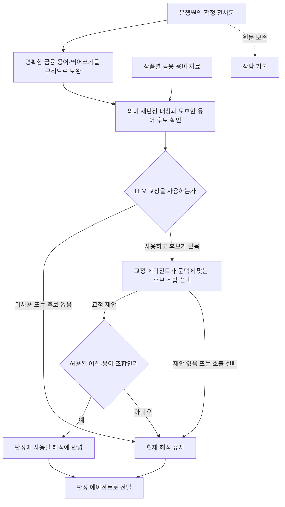
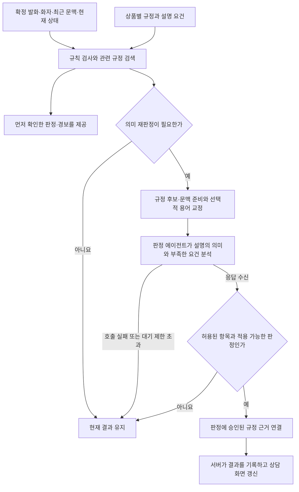
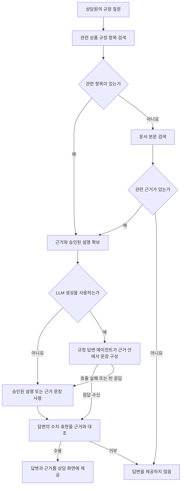

## 말틈 에이전트별 담당 역할과 동작 과정

이 문서는 전사 교정·판정·규정 답변 에이전트가 **어떤 입력을 받아, 어떤 과정을 거쳐, 무엇을 반환하는지** 설명한다. 전체 시스템에서의 위치는 [[말틈 엔진 전체 구성과 에이전트 역할]], 검증 수치와 실험 조건은 [[말틈 엔진 실험 결과]]에서 확인할 수 있다.

세 에이전트는 엔진이 정한 흐름에 따라 호출되는 AI 역할이다. 그림에는 각 역할을 이해하는 데 필요한 규칙 처리·검색·결과 검사도 함께 표시했다. 이 보조 단계들은 별도의 LLM 에이전트가 아니다.

### 1. 전사 교정 에이전트

#### 담당 역할과 입력·출력

음성 인식 결과에서 모호하게 표기된 금융 용어를 상품별 용어와 대조해 해석한다. 예를 들어 “차감눌”처럼 잘못 인식된 어절에 대해, 허용된 후보인 “차감률”로 읽을 수 있는지 판단한다. 교정 결과는 후속 판정에 사용할 해석에 반영한다.

| 구분 | 내용 |
| --- | --- |
| 실행 시점 | 의미 재판정 대상이 있고, 은행원 발화에 모호한 용어 후보가 있으며, LLM 교정 기능을 사용하는 경우에 실행한다. |
| 입력 | 현재 발화와 엔진이 미리 선정한 어절·금융 용어 후보 조합을 받는다. |
| 출력 | 문맥에 맞는 후보 조합을 선택해 반환한다. 확신할 수 없으면 교정을 제안하지 않는다. |
| 후속 처리 | 엔진이 허용된 조합인지 검사한 뒤, 판정 에이전트에 전달할 문장에 반영한다. |

#### 동작 과정

먼저 규칙으로 “차감율 → 차감률”, “우대 이자 율 → 우대이자율”처럼 명확한 표현을 보완한다. 규칙으로 확정하기 어려운 표현은 원래 어절과 가능한 용어를 묶어 교정 에이전트에 전달한다. 모델이 선택한 단어라도 미리 허용한 조합이 아니면 반영하지 않는다.

저장된 전사문을 다시 쓰거나 상담원이 말하지 않은 설명을 추가하지 않는다. 숫자 해석과 오류 탐지는 별도의 수치 대조 기능이 담당한다. 따라서 “십사 퍼센트”를 14%로 읽을 수는 있지만, 잘못 안내한 14%를 올바른 기준 수치로 교체하지 않는다.

### 2. 판정 에이전트

#### 담당 역할과 입력·출력

상담 발화가 규정에서 요구하는 설명을 어느 정도 충족했는지, 금지된 취지를 포함하는지 판단한다. 규칙으로 직접 확인하기 어려운 우회 표현과 부분 설명을 의미 단위로 해석한다.

| 구분 | 내용 |
| --- | --- |
| 실행 시점 | 규칙 검사와 관련 규정 검색을 거쳐 의미 재판정이 필요한 경우에 실행한다. |
| 입력 | 발화문, 은행원·고객 구분, 최근 문맥, 현재 설명 상태와 관련 규정 후보를 받는다. |
| 출력 | 규정 항목별 설명 상태, 빠진 요건, 금지 발언 판단을 정해진 형식으로 반환한다. |
| 후속 처리 | 엔진이 적용 가능한 결과인지 검사하고 규정 근거를 연결한다. 서버가 상담 화면과 기록에 반영한다. |

#### 동작 과정

규칙과 검색은 발화를 어떤 규정과 비교할지 좁힌다. 판정 에이전트는 그 후보와 설명 요건을 기준으로 의미를 해석하며, 새로운 규정 항목을 만들지 않는다. 결과를 받으면 엔진이 허용된 항목과 상태 변경인지 검사한다. 모델이 작성한 인용문을 사용하지 않고, 승인된 규정 자료에서 근거를 연결한다.

예를 들어 “중도해지하시면 이자가 좀 줄어듭니다”는 중도해지의 영향을 언급했지만, 적용 이율과 계산 기준까지 설명한 문장은 아니다. 엔진은 부분 충족으로 판단하고, 부족한 설명 요소를 상담원에게 제시할 수 있다.

설명 이행과 수치 정확성은 따로 판단한다. 세금을 설명하면서 잘못된 세율을 말한 경우에는 설명 충족과 수치 불일치 경보가 함께 존재할 수 있다. 판정 에이전트는 수치 오류를 교정하지 않는다.

### 3. 규정 답변 에이전트

#### 담당 역할과 입력·출력

상담원이 직접 입력한 규정 질문에 대해, 검색한 문서 근거를 바탕으로 설명을 제공한다. 상담원은 답변과 출처를 확인한 뒤 실제 안내에 활용할 수 있다.

| 구분 | 내용 |
| --- | --- |
| 실행 시점 | 상담원이 질문을 입력하면 답변 경로가 실행된다. LLM 문장 생성은 선택적으로 사용한다. |
| 입력 | 현재 질문과 검색한 규정 근거·승인된 설명을 받는다. |
| 출력 | 근거 범위 안의 짧은 답변을 제공한다. 답변에 사용할 근거가 없으면 답변하지 않는다. |
| 후속 처리 | 엔진이 답변과 근거를 대조한 뒤 상담 화면에 함께 제공한다. 질문 조회만으로 설명 이행 상태를 변경하지 않는다. |

#### 동작 과정

“중간에 깨면 이자가 어떻게 되나요?”라는 질문을 받으면 해당 상품의 중도해지 규정을 찾는다. 관련 항목에 승인된 설명이 있으면 이를 활용하고, 필요한 경우 검색한 근거를 바탕으로 답변 문장을 생성한다. 생성 결과에 근거 밖 수치나 표현이 포함됐는지 검사한 뒤 채택한다. 이 검사는 모든 의미 오류가 없음을 보장하는 것은 아니다.

질문에 답할 근거가 없으면 모델의 일반 지식으로 내용을 채우지 않는다. 생성 호출이 실패하면 확보한 근거 문장을 대체 답변으로 사용할 수 있다. 현재 질문과 선택된 근거를 중심으로 동작하며, 전체 상담이나 이전 질문을 모두 기억하는 대화형 기능은 아니다.

### 세 역할이 결과를 연결하는 방식

전사 교정은 판정에 사용할 발화 해석을 보완하고, 판정은 실제 상담에서 이루어진 설명을 평가한다. 규정 답변은 상담원이 다음 설명에 참고할 정보를 제공한다. 답변을 화면에 표시한 것과 실제로 고객에게 설명한 것은 구분하며, 모든 역할은 원본 발화와 승인된 근거를 기준으로 동작한다.
