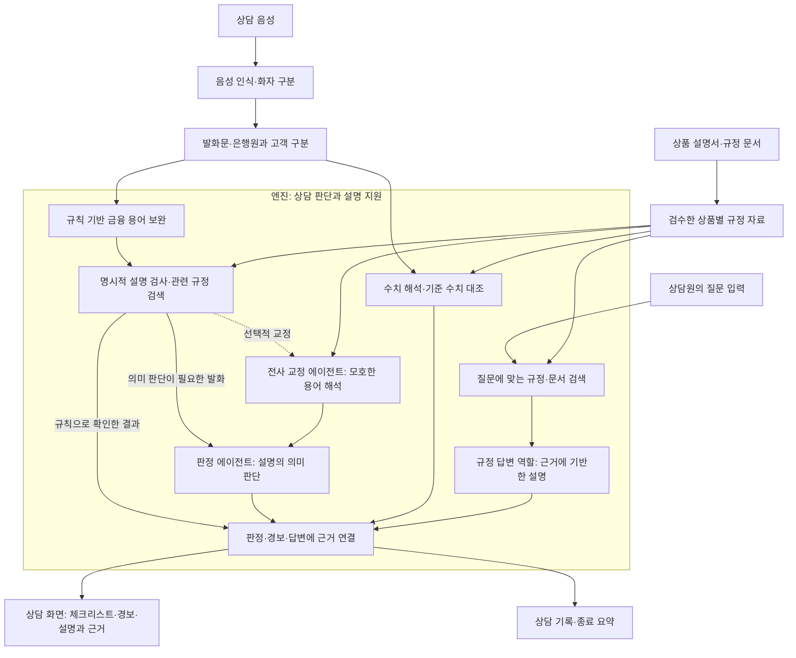

## 말틈 엔진 전체 구성과 에이전트 역할

말틈은 금융 상담 내용을 상품별 규정과 비교해, 상담원에게 **빠진 설명·잘못된 수치·금지 발언을 알리고 필요한 설명과 근거를 제공하는 상담 지원 시스템**이다. 엔진은 음성 인식 결과와 규정 자료를 받아 이러한 판단과 답변을 만드는 계층이다.

엔진의 AI 역할은 전사 교정, 규정 판정, 규정 답변의 세 가지로 구성된다. 세 역할은 정해진 처리 흐름에 따라 실행되며, 규칙 검사·검색·수치 대조를 공통으로 활용한다.

### 엔진 층위에서 보는 전체 구성

음성 인식과 화자 구분은 엔진에 발화를 전달하는 앞단에서 이루어진다. 엔진은 발화를 분석한 결과를 서버에 전달하고, 서버가 화면 반영과 상담 기록을 관리한다. 상품별 규정 자료에는 필수 설명, 금지 사항, 기준 수치, 승인된 쉬운 설명과 원문 근거가 포함된다.

### 세 에이전트의 역할

| 역할 | 다루는 입력 | 수행하는 일 | 상담에 제공하는 결과 |
| --- | --- | --- | --- |
| 전사 교정 에이전트 | 잘못 표기됐을 가능성이 있는 금융 용어와 허용된 용어 후보를 받는다. | 모호한 용어를 문맥에 맞게 해석해 판정에 전달한다. | 음성 인식 오류 때문에 설명 내용을 놓치는 사례를 줄이도록 돕는다. |
| 판정 에이전트 | 상담 발화, 발화자, 최근 문맥과 관련 규정을 받는다. | 설명의 충족 여부와 금지 취지를 판단한다. | 설명 상태, 부족한 요건, 금지 발언 판단을 제공한다. |
| 규정 답변 에이전트 | 상담원이 입력한 질문과 검색한 문서 근거를 받는다. | 근거 범위 안에서 답변을 구성한다. | 상담원이 참고할 설명과 그 출처를 제공한다. |

숫자 오류는 별도 수치 대조 기능이 담당한다. 예를 들어 “십사 퍼센트”를 14%로 해석하고 규정의 세율과 비교하되, 실제로 말한 숫자를 올바른 값으로 바꾸지는 않는다. 규칙 검사와 검색도 세 에이전트를 지원하는 처리 단계다.

### 상담 중의 두 가지 동작 흐름

**자동 상담 분석:** 발화가 들어오면 용어를 보완하고 명시적 설명과 숫자를 검사한다. 규칙으로 확인한 결과는 먼저 제공하고, 의미 해석이 필요한 발화는 판정 에이전트가 분석한다. 용어가 모호하면 선택적으로 전사 교정을 거친다. 결과는 해당 규정의 근거와 함께 상담 화면과 기록에 반영한다.

**상담원의 규정 질문:** 상담원이 질문을 입력하면 관련 규정과 문서 근거를 검색해 답변을 제공한다. 이 흐름은 자동 상담 분석과 목적이 다르다. 답변을 조회했다는 사실만으로 필수 설명을 완료했다고 표시하지 않으며, 실제로 안내한 발화를 통해 이행 여부를 판단한다.

### 현재 구현과 실험에서 확인한 범위

| 구분           | 현재 확인한 상태                                                                     |
| ------------ | ----------------------------------------------------------------------------- |
| 음성 입력과 판정 연결 | 로컬 음성 인식·화자 분리·의미 검색과 외부 API의 Qwen3-8B를 연결했다. 예금·대출 TTS 실행에서 대본의 기대 요약과 일치했다. |
| 실시간 의미 판정    | Qwen3-8B의 추론 모드를 끄고, 판정 응답 대기를 3초로 제한한다. 실패하거나 늦으면 먼저 확보한 결과를 유지한다.           |
| 전사 교정        | 규칙 기반 용어 보완은 사용한다. LLM 교정 경로는 구현돼 있으나 현재 확인한 구성에서는 비활성화돼 있다.                  |
| 규정 답변        | 상담 화면의 질문과 답변 경로가 연결돼 있다. 현재는 승인된 설명·검색 근거를 사용하며, 선택적 LLM 생성은 비활성화돼 있다.       |
| 답변용 32B      | 검토 중인 모델 적용 방향이다. 별도 연결과 질의응답 성능 검증을 완료한 상태는 아니다.                             |

전사 교정과 답변 생성의 LLM을 사용하지 않아도 기본 용어 보완과 근거 기반 답변은 동작한다. 따라서 세 역할이 구성돼 있다는 설명과 세 개의 LLM을 매번 호출한다는 설명은 구분한다.

### 내부망 운영 방향과 검증 근거

최종 운영 방향은 음성 인식·검색·언어모델 추론을 내부망에서 처리해 상담 데이터가 외부로 나가지 않도록 하는 것이다. 현재 실험에서는 음성 인식과 검색을 로컬에서 실행하고, 언어모델은 OpenRouter로 검증했다. 이는 소형 모델을 활용한 기능 구현의 개연성을 보여주지만, 완전한 내부망 운영이나 로컬 LLM의 속도를 실증한 결과는 아니다.

각 역할의 입력·처리·출력과 동작 흐름도는 [[말틈 에이전트별 담당 역할과 동작 과정]]에, 실험 조건·변경 전후 수치·검증 범위는 [[말틈 엔진 실험 결과]]에 제시한다.
