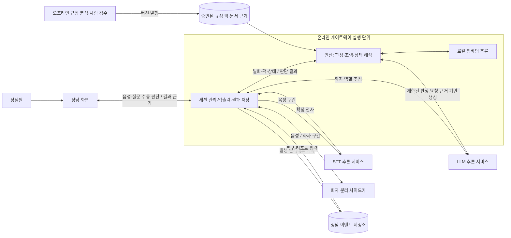
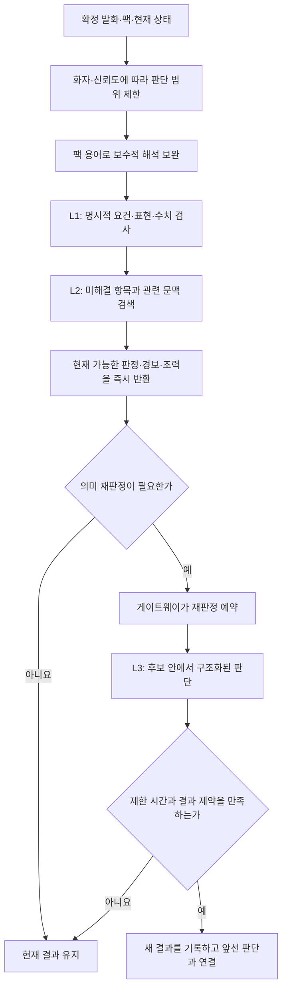

## 말틈 엔진 아키텍처

말틈 엔진은 승인된 규정 팩을 기준으로 상담 발화를 평가하고, 상담원이 보완할 설명과 그 근거를 돌려주는 판단 계층이다. 규정을 발행하는 과정, 상담을 받아들이는 게이트웨이, 결과를 보여주는 화면 사이에 놓인다. 이 구조의 목적은 상담 중 필요한 반응 속도를 확보하면서도, 나중에 어떤 발화와 규정으로 판단했는지 설명할 수 있게 하는 것이다.

> [!info] 문서 범위
> 시스템 외부와의 관계, 독립 실행 단위, 엔진 전체의 공통 개념과 설계 결정을 다룬다. 2026-09-05에 코드·계약·기획·실험 기록을 대조했다. 수치 표현과 분리 발화 보완은 [숫자 발화 보완 PR](https://github.com/malhaemohae/malteum/pull/27)에 구현돼 있으며, 확인 시점에는 통합 전이었다. 아직 검토 중인 모델 분리는 현재 구조와 구분해 적는다.

### 1. 시스템 경계와 실행 책임

문서 분석과 상담 대조는 서로 다른 시간에 실행된다. 규정을 분석하고 검수하는 작업을 상담 중에 다시 수행하면, 문서 처리 비용과 모델 오류가 상담 응답에 직접 영향을 준다. 그래서 오프라인에서 검증한 팩을 발행하고, 온라인에서는 상담 시작 시 선택한 팩으로 대조한다. 새 규정 발행과 진행 중인 상담의 판단 기준을 분리하는 것도 이 경계의 목적이다.

엔진은 게이트웨이 프로세스 안에서 실행되는 라이브러리다. L1·L2·L3는 판단의 역할 구분이며 각각 별도 서버가 아니다. 음성 인식과 화자 분리는 엔진 밖에서 이루어지고, 엔진은 화자와 신뢰도가 붙은 확정 발화를 입력받는다. 연결, 오디오 전송, 세션 생명주기와 저장은 게이트웨이가 책임진다.

| 실행 경계 | 맡는 책임과 분리 이유 |
| --- | --- |
| 오프라인 규정 처리 | 항목·수치·쉬운 설명·문서 근거를 추출하고 사람 검수를 거쳐 발행한다. 상담 중 모델이 규정을 새로 정의하지 못하게 한다. |
| 온라인 게이트웨이와 내장 엔진 | 게이트웨이는 실행 순서와 기록을 관리하고, 엔진은 팩·발화·상태를 판단한다. 저장 기술을 바꾸거나 음성 없이 시험해도 판단 규칙을 재사용할 수 있다. |
| 음성 인식·화자 분리 추론 | 음향 모델의 자원 요구와 배치 방식이 판단 로직에 전파되지 않게 한다. STT를 교체해도 엔진 입력의 의미는 같아야 한다. |
| LLM 추론 서비스 | 모델의 비결정성과 외부 호출 실패를 어댑터 경계 안에 둔다. MVP의 외부 API와 내부망 모델 서빙을 같은 판단 경로에 연결할 수 있게 한다. |
| 저장 계층 | 승인된 규정과 상담 기록의 정본을 보관한다. 엔진의 검색 인덱스나 캐시는 정본을 대신하지 않는다. |

소유권도 이 책임과 맞춘다. 게이트웨이·엔진·규정 발행·프론트는 계약으로 협업하며, 엔진이 게이트웨이나 규정 발행 구현을 직접 가져다 쓰지 않는다. 공통 명세는 [모듈 간 계약](https://github.com/malhaemohae/malteum/tree/dev/back/contracts)에 두고 이 문서에 별도 사본을 만들지 않는다.

### 2. 엔진 전체가 공유하는 개념

#### 규정 팩과 근거

팩은 특정 버전의 규정을 실행 가능한 판단 기준으로 묶은 단위다. 필수 안내, 금지 취지, 위험 신호, 참고 정보를 구분하며, 요건 요소와 원문 근거를 함께 가진다. 상품별 내용을 코드에 분산시키지 않는 이유는 규정 변경을 팩 발행으로 관리하고, 과거 상담에 적용했던 기준을 계속 식별하기 위해서다.

한 상담은 선택한 팩 버전에 묶인다. 진행 중에 최신 팩으로 몰래 바꾸면 앞뒤 판단의 기준이 달라지고 과거 결과를 설명하기 어려워진다. 임베딩을 교체할 때에도 기존 팩과 질문의 벡터가 같은 의미 공간에 속해야 한다. 차원 검사를 통과했다고 같은 검색 기준이라고 볼 수는 없으므로, 모델 변경은 팩의 검색 자료와 검증 결과를 함께 다루는 결정이다.

근거는 모델이 만들어 내는 인용문이 아니라 발행된 팩이나 검색된 문서에서 온다. 원문의 인용 구간과 위치가 있어야 화면과 리포트에서 판단 이유를 다시 확인할 수 있다. 원문에 없는 인용을 폐기하는 책임은 팩 검증에 있고, 엔진은 판단 결과에 승인된 근거를 연결한다.

#### 판정·경보·조력

| 개념 | 의미와 경계를 두는 이유 |
| --- | --- |
| 판정 | 어떤 규정 항목을 어느 정도 설명했는지, 금지 취지가 확인됐는지, 이해 확인 신호가 있는지를 상태로 표현한다. |
| 경보 | 상담원이 즉시 확인할 문제를 알린다. 수치 오류나 위험 신호를 알렸다는 사실만으로 모든 판단 축의 상태가 바뀌지는 않는다. |
| 조력 | 쉬운 재설명, 빠진 안내의 알림, 규정 답변, 브리핑, 필요 서류 안내를 제공한다. 카드를 보여준 것과 실제로 안내한 것을 구분한다. |

설명의 완결성, 수치의 정확성, 고객의 이해는 서로 다른 질문이다. 세금에 관해 설명했더라도 세율은 틀릴 수 있으므로, 설명 항목의 충족 판정과 수치 불일치 경보가 동시에 존재할 수 있다. 고객의 이해 확인 신호도 설명 이행 전체를 증명하는 것으로 확대하지 않는다.

#### 발화자와 신뢰도

같은 문장도 은행원이 말했는지 고객이 말했는지에 따라 의미가 다르다. 은행원의 설명을 평가하는 기준과 고객의 위험·되물음·이해 신호를 평가하는 기준을 분리한다. 화자 신뢰도가 낮은 발화를 근거로 설명을 완료했다고 올리지 않는 것이 기본 방향이다.

이 선택은 누락 안내가 보수적으로 남는 비용을 받아들이는 대신, 하지 않은 설명을 했다고 표시하는 위험을 줄인다. 모델 성능이 좋아지더라도 이 비대칭은 유지해야 할 제품의 판단 원칙이다.

### 3. 빠른 판정과 늦게 도착하는 재판정

모든 발화를 LLM 응답이 올 때까지 붙잡으면 상담 화면이 모델과 네트워크의 지연을 그대로 부담한다. 반대로 키워드 일치만으로 설명의 취지를 확정하면 돌려 말한 문장과 모호한 표현을 처리하기 어렵다. 그래서 즉시 처리할 수 있는 판단과 의미 해석이 필요한 판단을 나눈다.

**L0의 용어 보완**은 STT의 띄어쓰기나 금융 용어 오인식을 팩의 어휘와 대조한다. 말하지 않은 개념을 덧붙이는 교정보다 원문을 보존하는 쪽을 우선한다. 판정용 해석을 보완하는 것이며 저장된 발화를 다시 작성하는 절차가 아니다.

**L1의 규칙 판단**은 명시적으로 충족된 요건, 금지 표현, 수치를 다룬다. 항목의 주제를 언급했다는 것과 요건을 설명했다는 것을 구분한다. 분명한 요건은 L1에서 충족으로 판단할 수 있으며, 부분 충족이나 의심 상태는 의미 재판정으로 이어질 수 있다. 수치 대조는 LLM의 판단으로 넘기지 않는다.

**L2의 후보 검색**은 규칙만으로 다루기 어려운 발화를 관련 항목에 연결한다. 한국어 표현이 깨지는 STT 특성을 고려해 어휘·자모 유사도를 주요 근거로 쓰고, 임베딩이 항목을 구별할 수 있을 때 의미 유사도를 보조로 사용한다. 임베딩 점수가 높다는 이유만으로 필수 안내를 충족했다고 올리지 않는다. 금지·위험 예시가 일반 항목의 주제 검색을 오염시키지 않도록 두 검색 목적도 구분한다.

**L3의 의미 재판정**은 후보 항목과 현재 상태, 화자가 표시된 최근 문맥을 받아 설명의 취지를 판단한다. 모델에게 항목이나 인용을 자유롭게 만들게 하지 않고, 허용된 항목과 요건 안에서 구조화된 결과를 받는다. 결과가 왔다는 이유만으로 적용하지 않으며, 판단 대상과 상태 변경 제약을 다시 확인하고 근거는 팩에서 연결한다.

게이트웨이는 세션별 재판정을 순서대로 반영한다. 화면을 기다리게 하지 않는 것과 같은 세션의 정정을 무제한 병렬 처리하는 것은 다르다. 순서를 보존해야 오래된 판단이 최신 상태를 덮거나, 앞선 결과를 가리키는 정정 이력이 엇갈리는 일을 피할 수 있다. 이 선택은 대기열이 길어질 수 있다는 한계를 가진다.

#### 수치는 해석하되 고치지 않는다

`15퍼`, `십오 퍼센트`, `15점사 퍼센트`처럼 표기가 달라도 비교 가능한 값과 단위로 해석할 수 있어야 한다. 그러나 잘못 말한 14%를 설명서의 15.4%로 바꾸면, 검출해야 할 오류 자체가 사라진다. 엔진은 발화 수치와 기준 수치를 각각 보존해 경보로 제시한다.

같은 단위라도 약정금리와 연체가산금리는 다른 사실이다. 주제·수치의 이름·적용 조건으로 비교 대상을 특정할 수 있을 때만 대조한다. 숫자만 이어지는 발화는 가까운 직전 은행원 문맥을 제한적으로 이용한다. 일부 긴 문맥을 놓치는 대신, 엉뚱한 상품 조건을 가져와 경보를 만드는 일을 줄이기 위한 제한이다.

### 4. 조력과 상담 중 규정 질의

조력은 판정과 같은 규정 팩·문서 근거를 이용하지만 목적이 다르다. 판정은 현재 상담을 평가하고, 조력은 상담원이 다음 설명을 선택하도록 돕는다. 조력 카드의 제시를 곧바로 설명 완료로 간주하지 않는 이유다.

승인된 쉬운 설명을 우선 재사용하면 지연과 생성 오류를 줄일 수 있다. 고객이 되물었을 때에는 관련 설명을 쉬운 말로 제공하고, 일부 요건이 빠졌을 때에는 그 누락 요소로 안내 문구를 조립한다. 브리핑과 서류 안내도 팩의 정보를 기반으로 한다. 문맥에 맞게 자유롭게 표현하는 능력은 제한되지만, 검수하지 않은 내용을 매번 새로 생성할 필요가 없다.

상담원이 직접 입력한 질문은 규정 항목을 먼저 찾고, 적절한 항목이 없으면 문서 본문에서 근거를 찾는 방식으로 처리한다. 현재는 질문 하나에 대한 근거 검색형 답변이며, 상담 전체나 질문 이력을 이해하는 다중 대화형 챗봇으로 간주하지 않는다. 타이핑한 질문은 은행원이 고객에게 실제로 말한 발화와도 구분한다.

LLM으로 답변 문장을 만드는 연결점은 이미 있지만, 현재 확인한 구성은 승인된 문장과 문서 근거를 직접 반환한다. 생성 기능을 사용할 때에도 먼저 근거를 확보하고 생성 결과를 근거와 대조한다. 이 검사는 근거 밖 수치나 표현을 줄이기 위한 방어이며 모든 의미 왜곡이 없음을 증명하지는 못한다.

**질문 답변에만 더 큰 모델을 사용하는 것은 별도 검토 방향이다.** 실시간 판정에 요구되는 지연과 사용자가 요청한 답변에 허용되는 지연은 다를 수 있다. 다만 현재 모델 조립은 판정과 생성의 모델 선택을 공유하며, 질문 처리도 응답을 기다리는 동안 같은 연결의 다음 입력을 지연시킬 수 있다. 질의에 32B를 사용할 수 있다는 의견을, 모델 분리와 비동기 처리가 이미 구현됐다는 의미로 해석하지 않는다.

### 5. 상태의 소유권과 재현성

상담 세션의 생명주기는 게이트웨이가 소유한다. 엔진에는 발화와 함께 현재 상태를 명시적으로 전달하고, 결과를 적용한 새 상태를 얻는다. 엔진 안의 팩 컴파일 결과와 추론 캐시는 반복 작업을 줄이는 파생 자료이며 상담 상태의 정본이 아니다.

정본은 발생 순서가 있는 이벤트다. 현재 체크리스트만 저장하면 왜 그 상태가 됐는지 잃어버린다. 그래서 발화, 판단, 경보, 조력과 사람의 조치를 기록하고, 정정은 과거 기록을 덮어쓰는 대신 새 기록에서 앞선 판단을 가리키게 한다. 최신 화면과 종료 리포트는 같은 이벤트 해석 원칙을 공유해야 한다.

저장과 전송도 구분한다. 화면 갱신 메시지에는 연결 상태와 임시 정보가 섞이지만, 장기 기록은 나중에도 독립적으로 해석할 수 있어야 한다. 이벤트의 식별과 순서 부여, 저장 후 전송은 게이트웨이가 책임지고, 엔진은 판단 내용과 근거를 돌려준다.

| 재현 방식 | 보장하려는 것 | 의미하지 않는 것 |
| --- | --- | --- |
| 저장 이벤트로 상태 복원 | 당시 기록된 판단과 정정을 같은 기준으로 해석한다. | 최신 모델이 같은 결정을 다시 내린다는 보장은 아니다. |
| 판정 캐시·LLM 결정 기록 재사용 | 동일한 팩·모델·발화·문맥·상태 조건에서 이미 얻은 결정을 재사용한다. | 캐시 적중을 새로운 모델 추론 성공으로 세면 안 된다. |
| 실제 음원 재처리 | STT·화자·검색·판정 경로가 함께 동작하는지 검증한다. | STT와 모델의 출력이 매번 같다는 보장은 아니다. |

모델의 비결정성을 없애는 대신 실제로 사용한 기준과 판단을 기록해서 설명 가능성을 확보한다. 사람이 남긴 해당 없음 처리에는 사유가 필요하며 사람의 조치도 이력으로 남는다. 자동 판단이 이미 충족한 설명을 미고지로 되돌리지 않는 원칙과, 사람이 자신의 조치를 명시적으로 정정하는 절차도 구분한다.

### 6. 주요 결정과 대가

| 결정 | 선택 이유 | 얻는 것과 받아들이는 한계 |
| --- | --- | --- |
| 규정 발행과 상담 대조를 분리한다. | 상담 중 문서 분석을 수행하면 지연과 판단 기준 변동을 통제하기 어렵다. | 규정 버전을 고정해 대조하지만, 새 규정은 검수·재발행을 거쳐야 한다. |
| 엔진을 계약 중심의 내장 판단 계층으로 둔다. | 세션·저장·통신 구현에 판단 로직이 의존하면 독립 검증과 교체가 어려워진다. | 입력을 통제한 시험과 어댑터 교체가 쉬워지지만, 계약 변경에는 공동 조율이 필요하다. |
| 빠른 판단과 LLM 재판정을 분리한다. | 모든 발화가 모델 지연을 기다리게 할 수 없다. | 화면을 빠르게 갱신하지만, 잠정과 재판정의 관계를 기록해야 한다. |
| 어휘 검색을 중심으로 의미 검색을 보조한다. | 실제 임베딩이 무관한 발화에도 높은 점수를 주고 STT 오류로 표기가 흔들렸다. | 무관한 후보를 줄이지만, 표현이 크게 달라지는 발화는 여전히 놓칠 수 있다. |
| 수치 오류를 규칙으로 검출하고 원문을 유지한다. | 모델이 올바른 수치로 바꾸면 오안내 사실을 잃는다. | 비교 근거를 명확히 제시하지만, 인식 불가능한 발음이나 모호한 비교 대상은 추정하지 않는다. |
| 생성보다 승인된 근거와 문장을 우선한다. | 새로 만든 설명은 잘못된 수치·약속을 포함할 수 있다. | 검수 범위와 응답 비용을 통제하지만, 자연스러운 맞춤 답변의 폭이 좁다. |
| 이벤트를 정본으로 삼는다. | 최종 상태만으로는 정정 이유와 실제 판단 이력을 복원할 수 없다. | 재생·감사·복구가 가능하지만, 정정 관계와 반영 순서를 일관되게 관리해야 한다. |
| 모델 장애 시 잠정 판단을 유지한다. | 외부 추론 실패가 상담 전체를 중단시켜서는 안 된다. | 규칙·검색·수동 조치는 계속 가능하지만, 의심을 위반으로 확정하지 못하는 결과가 남을 수 있다. |

### 7. 배치 원칙과 결정의 변화

제품 배치는 내부망에서 음성 인식과 LLM을 운영하는 것을 목표로 한다. MVP에서 외부 추론 서비스를 이용하는 것은 이 배치 원칙을 이미 충족했다는 뜻이 아니다. 로컬 STT와 오픈 가중치 LLM을 검증하는 이유는 교체 가능한 경계와 기능적 개연성을 확인하기 위해서다. 외부 API 지연을 내부 GPU 성능으로 옮겨 쓰거나, 일부 모델만 로컬에서 실행한 결과를 전체 데이터 비유출의 증명으로 사용하지 않는다.

| 앞선 판단·기록 | 현재의 해석과 후속 결정 |
| --- | --- |
| 초기 기획은 LLM을 최종 판정자로 표현했다. | 모든 발화의 강제 LLM 호출을 뜻하지 않는다. 현재는 명시적인 요건을 규칙으로 처리하고, 모호한 취지를 L3로 판단하며 수치는 규칙이 전담한다. |
| 초기 계약은 L3 응답에 1.5초를 배정했다. | 외부 왕복 때문에 유효한 판단도 버려지는 문제가 있어, 현재 실시간 검증 기준은 Qwen3-8B·reasoning off·3초로 정했다. 관측에 근거한 현재 결정이며 고정 SLA의 증명은 아니다. |
| Qwen3-32B를 비교 기준으로 사용했다. | 현재 실시간 3초 경로에서는 사용 후보에서 제외한다. 질문 답변 전용 사용은 별도 품질·지연 검증이 필요한 검토 방향이다. |
| 초기 실물 연결 기록에는 임베딩 미연결과 서버 재판정 미호출이 남아 있었다. | 로컬 임베딩과 게이트웨이의 비동기 재판정 경로가 연결됐다. 그 기록은 당시 상태로 보존하며 현재의 미구현 목록으로 읽지 않는다. |
| 기존 수치 대조는 아라비아 숫자 표기와 한 발화 안의 주제 연결을 중심으로 처리했다. | 용어 보완과 수치 해석을 분리한다. 로컬 ASR의 한글·아라비아 혼합 수치와 문장 분리는 수치 대조 경계에서도 다뤄야 한다. |

앞선 실물 모델 비교의 근거는 [[0831 engine 실물 LLM 연결 결과와 월요일 안건 5건]]에 있다. 다른 LLM 후보의 성적도 이 기록에 있지만, 당시의 작은 판정 세트 결과를 현재의 전체 상담 성능이나 최신 모델 공급 상태로 간주하지 않는다. 모델 선택은 정확도뿐 아니라 호출 지연, 라이선스, 배치 가능성, 실패 시 동작을 함께 평가하는 결정이다.

### 8. 반드시 유지할 성질과 검증 방법

| 유지할 성질 | 깨졌음을 확인하는 방법 |
| --- | --- |
| 판단 기준은 승인된 팩과 일치해야 한다. | 계약 fixture 검증, 팩 버전·임베딩 차원 검사, 팩 변경 후 검색 골든셋 비교로 확인한다. |
| 근거는 원문에서 확인할 수 있어야 한다. | 발행 시 인용 구간의 원문 실재를 검사하고, 답변·재진술의 근거 밖 수치를 거부하는 사례를 검증한다. |
| 불확실한 발화로 설명 완료를 만들어서는 안 된다. | 낮은 화자 신뢰도, 고객 발화, 무관한 주제, 모호한 표현을 넣고 잘못된 충족 판정이 생기는지 확인한다. |
| 수치를 해석하면서 원문이나 오류 사실을 바꾸면 안 된다. | 혼합 표기, 문장 분리, 같은 단위의 다른 조건, 정상 수치를 함께 넣어 검출과 오탐을 대조한다. |
| 늦은 결과나 모델 장애가 상담의 기본 경로를 중단시키면 안 된다. | 모델 부재·오류·제한 시간 초과를 주입하고 잠정 판단과 수동 조치가 유지되는지 확인한다. |
| 화면과 리포트는 같은 이력을 해석해야 한다. | 저장 이벤트를 접은 결과와 실시간 상태를 비교하고, 정정·재접속·종료를 포함한 재생을 검증한다. |
| 추론 서비스 교체가 판단 계약을 바꾸면 안 된다. | 동일한 전사문을 사용하는 엔진 회귀와 실제 음원을 사용하는 전체 경로 검증을 나눠 수행한다. |

규칙 시험, 저장된 로컬 전사문 재생, 실제 TTS 파이프라인, 실물 LLM 반복 비교는 서로 다른 오류를 발견한다. 한 종류의 성공으로 나머지를 대체하지 않는다. 합성 음성의 성공은 실제 창구의 잡음·겹침·사투리까지 포괄하지 않는다. 세부 성적과 실행 명령은 [수치 대조 실험 기록](https://github.com/malhaemohae/malteum/blob/feat/engine-numeric-context/back/engine/experiments/numeric_context/RESULT.md)에 두고, 이 문서에는 그 결과가 바꾼 결정만 유지한다.

### 팀에서 사용하는 말

| 용어 | 이 문서에서의 뜻 |
| --- | --- |
| 팩 | 검수·버전 발행을 거친 상품별 규정 판단 자료다. |
| 근거 스팬 | 설명의 출처가 되는 원문 인용 구간과 그 위치다. |
| 잠정 판정 | 현재 확보한 증거로 먼저 내린 결과다. 필요한 경우 LLM이 재판정하지만, 실패했다고 반대 판단으로 바꾸지는 않는다. |
| 조력·넛지 | 조력은 상담을 돕는 답변·설명·안내를 포괄하며, 넛지는 그중 아직 빠진 설명을 알려주는 안내다. |
| P1 | 문서 분석과 실시간 상담 대조의 두 시간축을 분리한다는 원칙이다. |
| P2 | 모델의 결정론 대신 기록과 재생으로 판단의 재현성을 확보한다는 원칙이다. |
| P3 | 하지 않은 설명을 했다고 표시하는 오류를 더 위험하게 보고, 불확실하면 미고지를 유지한다는 원칙이다. |
| P4 | 원문 근거가 없는 규정 항목과 답변을 인정하지 않는다는 원칙이다. |

### 근거 자료

- [핵심 기획과 설계 원칙](https://github.com/malhaemohae/malteum/blob/dev/docs/기획/핵심기획안.md): 제품 목적, 두 시간축, 판단 축과 배치 전제를 확인한다.
- [모듈 간 계약](https://github.com/malhaemohae/malteum/tree/dev/back/contracts): 데이터 명세와 정정·상태 해석의 정본이다.
- [로컬 STT와 온프레미스 경로 실험](https://github.com/malhaemohae/malteum/blob/dev/docs/실험/2026-09_STT_화자분리_온프레미스_경로.md): 음향 처리 경계와 모델 교체의 근거를 확인한다.
- [화자 단계와 실제 상담 경로 실측](https://github.com/malhaemohae/malteum/blob/dev/docs/실험/2026-09-04_화자단계_E2E_실측.md): 화자 신뢰도와 비동기 판단의 제약을 확인한다.
- [[0831 engine 실물 LLM 연결 결과와 월요일 안건 5건]]: 초기 대안 비교와 이후 바뀐 판단의 출처다.
