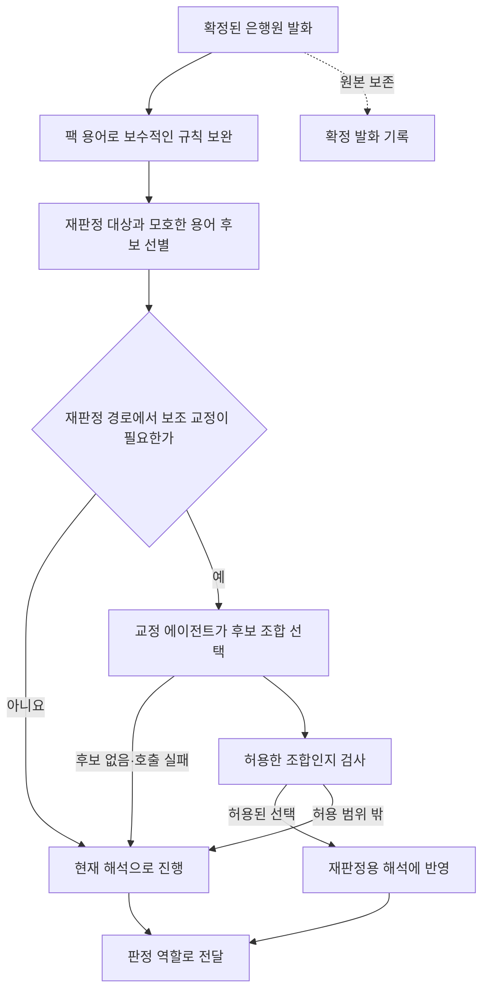

## 말틈 전사 교정 에이전트 아키텍처

전사 교정 에이전트는 STT가 잘못 받아 적었을 가능성이 있는 금융 용어를, 팩이 허용한 후보 안에서 선택하는 보조 역할이다. 문장을 더 자연스럽게 다시 쓰거나 은행원이 말한 내용을 올바른 안내로 바꾸는 역할은 맡기지 않는다. 교정으로 상담의 오류 증거를 없애면 안 되기 때문이다.

전체 실행 경계는 [[말틈 엔진 아키텍처]]를 따른다. 이 역할은 엔진의 의미 재판정 경로에 선택적으로 연결되며, 독립적인 STT 서비스나 상시 문장 교정 서버가 아니다. 2026-09-05에 확인한 로컬 구성에서는 이 LLM 보조 기능을 사용하지 않고, 규칙 기반 용어 보완을 먼저 적용한다.

### 교정을 별도 역할로 두는 이유

STT의 금융 용어 오인식과 실제로 잘못 말한 안내는 겉보기만으로 구별하기 어렵다. 모델에 전체 발화를 자유롭게 고치라고 하면, 발음이 비슷한 용어를 복원하는 작업과 잘못된 내용을 정상 설명으로 바꾸는 작업이 섞인다. 그래서 교정 후보를 팩의 어휘에서 먼저 만들고, 모델에는 그 후보를 선택하는 권한만 준다.

이 분리는 교정의 성공을 상담의 정확성으로 착각하지 않게 한다. 용어를 올바르게 해석해도 해당 설명이 완전한지는 판정 역할이 판단해야 한다. 수치가 잘못된 경우에는 원래 값과 기준 값을 비교해 경보를 내야 한다.

| 경계 | 설계상 의미 |
| --- | --- |
| 판단의 재료 | 현재 은행원 발화와 미리 좁힌 어절·용어 후보를 사용한다. 일반 상식이나 외부 문서를 탐색해 새로운 용어를 추가하지 않는다. |
| 허용한 결정 | 주어진 어절을 주어진 용어로 읽는 것이 문맥상 분명한지 선택한다. 확신이 없으면 아무 후보도 선택하지 않을 수 있다. |
| 엔진이 유지하는 권한 | 선택된 어절과 용어의 조합이 실제 허용 후보인지 다시 검사하고, 재판정용 해석에만 적용한다. |
| 보존할 대상 | 저장된 확정 발화, 발화 수치, 설명자가 실제로 한 말의 의미를 유지한다. 교정이 판정·상담 기록을 직접 갱신하지 않는다. |

### 규칙 보완과 LLM 교정의 관계

분명한 띄어쓰기나 제한된 용어 오인식은 규칙으로 먼저 처리한다. 명확한 사례까지 모델에 맡기면 외부 의존성과 지연만 늘어난다. 반면 규칙이 확신하지 못한 후보를 무조건 치환하면 과교정이 발생하므로, 필요한 경우에만 문맥 판단을 추가한다.

교정은 이미 선택한 재판정 대상을 돕는 경로다. 모든 STT 문장을 빠짐없이 복원하거나, 검색에서 누락된 모든 규정 항목을 새로 찾아내는 장치로 보지 않는다. 이 제한은 호출 범위를 통제하는 대신 회복 가능한 오인식의 범위를 좁힌다.

### 주요 결정과 대가

| 선택한 구조 | 이유 | 받아들이는 한계 |
| --- | --- | --- |
| 자유 재작성 대신 허용된 후보 선택을 사용한다. | 발화를 유창하게 만드는 과정에서 없던 설명이나 수치가 생기는 것을 막아야 한다. | 후보에 없는 표현은 모델이 알아도 복원하지 못한다. |
| 규칙 보완을 먼저 사용한다. | 명확한 용어 일치에 외부 모델을 호출할 필요가 없다. | 규칙이 처리하지 못한 모호성이 일부 남는다. |
| 후보의 개별 단어뿐 아니라 조합을 검사한다. | 각각 허용된 어절과 용어라도 잘못 짝지으면 다른 의미로 바뀔 수 있다. | 모델의 제안 일부를 버리고 원래 해석을 유지할 수 있다. |
| 교정 실패 시 현재 해석으로 진행한다. | 부가 기능의 장애가 기본 판정을 중단시켜서는 안 된다. | 교정이 있었으면 찾았을 판단을 놓칠 수 있다. |
| 저장 원문과 판정용 해석을 분리한다. | 과거 상담에서 실제로 어떤 전사가 있었는지 확인할 수 있어야 한다. | 정규화된 해석만으로 원래 발화를 재구성해서는 안 된다. |

“숫자를 바꾸지 않는다”는 것은 숫자 표기를 전혀 해석하지 않는다는 뜻이 아니다. `십오 퍼센트`를 비교용 15%로 읽는 일은 별도의 수치 대조가 맡는다. 이 역할은 틀린 14%를 설명서의 15.4%로 바꾸는 결정을 내려서는 안 된다.

### 다른 역할과 공유하지 않는 책임

팩의 용어를 정하고 승인하는 일은 규정 발행의 책임이다. 설명의 충족 여부를 정하는 일은 판정 역할의 책임이고, 쉬운 답변을 구성하는 일은 조력·답변 역할의 책임이다. 교정 역할이 이 책임을 함께 맡으면 “무엇을 들었는가”와 “무엇을 말했어야 하는가”가 섞인다.

최근 상담 문맥을 사용하는 판정 역할과 달리, 현재 교정 요청의 판단 범위는 해당 발화와 후보들이다. 풍부한 대화 문맥을 이미 이용한다고 가정하지 않는다. 판정 캐시나 LLM 결정 기록도 교정 과정 전체를 그대로 녹화하는 장치로 해석하지 않는다. 교정 판단이 달라지면 후속 판단에 주는 입력도 달라질 수 있다.

### 지연과 사용 범위

교정은 추가 추론이므로 오류 회복의 이득과 응답 지연을 함께 평가해야 한다. 현재 판정 LLM의 제한 시간은 교정부터 결과 반영까지의 전체 시간을 감싸는 보장이 아니다. 교정을 켠 경우에도 전체 재판정 지연이 같은 한도라고 주장하지 않는다.

기존 기록에는 실제 LLM 교정 연결이 확인된 사례가 있지만, 연결 가능성과 현재 사용 여부는 다르다. 지금은 이 역할을 선택적인 확장점으로 유지한다. 특정 크기의 모델을 교정용으로 별도 선정했다는 결정도 없다.

### 유지해야 할 성질

| 성질 | 확인할 실패 사례 |
| --- | --- |
| 허용된 어절·용어 조합만 반영해야 한다. | 후보에 없는 조합이나 존재하지 않는 용어를 모델이 제안했을 때 버려지는지 확인한다. |
| 원문과 수치의 의미를 보존해야 한다. | 정상 수치·잘못된 수치·이미 올바른 용어를 넣고 기록이나 안내 의미가 달라지는지 확인한다. |
| 모호한 경우 무교정을 허용해야 한다. | 비슷한 후보가 여럿일 때 임의의 하나로 확정하는지 확인한다. |
| 부가 기능의 실패가 기본 경로를 중단시키면 안 된다. | 외부 호출 실패나 응답 형식 오류에서 현재 해석으로 진행하는지 확인한다. |
| 교정 효과를 전체 성능으로 과장하면 안 된다. | 교정 전후의 용어 해석뿐 아니라 판정 누락·오탐·전체 응답 지연을 함께 대조한다. |

초기 연결과 선택 이유는 [[0831 engine 실물 LLM 연결 결과와 월요일 안건 5건]], 수치 처리와의 분리 원칙은 [수치 대조 실험 기록](https://github.com/malhaemohae/malteum/blob/feat/engine-numeric-context/back/engine/experiments/numeric_context/RESULT.md)에 연결한다.
