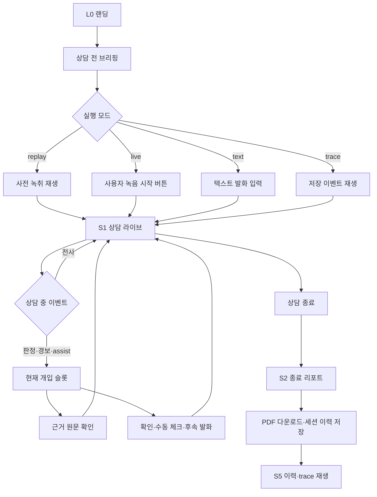

# 말틈 프론트엔드 제품 범위·현재 구현·사용자 플로우

> 기준일: 2026-09-03  
> 기준 브랜치: `feat/front-next`  
> 문서 위치 원칙: 이 문서와 이후 프론트 작업 산출물은 `front/` 아래에 둔다.  
> 문서 목적: 현재 화면이 실제로 무엇을 보여 주고 어떻게 동작하는지, 백엔드 계약이 목표로 하는 제품 플로우가 무엇인지, 다음 구현에서 무엇을 연결해야 하는지를 한 문서에서 확인한다.

> **현재 기준 안내:** 기획·계약·백엔드·프론트를 다시 대조한 최신 감사본은 [`USER_FLOW_AND_VISIBLE_INFORMATION.md`](./USER_FLOW_AND_VISIBLE_INFORMATION.md)이다. 이 문서는 누적 작업 기록이므로, 상품/팩/시나리오와 현재 코드의 일치 여부는 최신 감사본을 우선한다.

## 0. 먼저 읽을 결론

말틈은 은행 창구 상담 중 규정·상품설명서 기준을 실시간으로 확인하고, 놓친 설명·잘못된 숫자·금지 표현·위험 신호를 은행원에게 알려 주며, 상담 종료 후 근거가 붙은 증빙 리포트를 남기는 컴플라이언스 가이드다.

현재 `front/`에는 다음이 구현되어 있다.

- 랜딩 화면에서 서비스 가치를 이해하고 기본 시연 경로로 브리핑에 이동한다.
- `원화 정기예금 중도해지`와 `가계 신용대출` 두 제품 시나리오와 실행 모드를 서버 계약에 맞춰 처리한다. 사용자가 브리핑에서 별도 환경 설정을 편집하지는 않는다.
- `REPLAY`, `LIVE`, `TRACE`, `TEXT` 모드를 분리하고, 시작 전 브리핑을 거쳐 상담 화면으로 들어간다.
- 상담 화면에서 순차 데모 이벤트, 개입 카드, 전사, 필수 안내 체크리스트, 항목별 근거, 규정 질의를 같은 세션 상태로 확인한다.
- 상담 종료 후 항목별 증빙·경보·assist 결과가 있는 종료 리포트로 이동하고, 브라우저 로컬 이력에서 리포트와 TRACE 재생을 다시 연다.
- 규정 팩과 문서 추출·검수 화면에서 역할별 운영 경로와 빈 상태·승인 상태를 확인할 수 있다.
- 튜토리얼은 랜딩과 브리핑에서는 열리지 않고, 상담 화면에 진입한 뒤 대시보드의 헤더·녹음·개입·전사·체크리스트·근거 6단계로 안내한다.
- 근거 원문 오버레이, 개입 확인, 수동 고지·면제, 텍스트 발화 입력, 새 상담 시작 등 시연에 필요한 로컬 상태 전환이 있다.
- 서버가 제공되면 동일한 화면이 `POST /sessions`·WebSocket·REST를 사용한다. 연결 상태, 서버 progress, partial/utterance/verdict/alert/assist/ended/error 이벤트, `resume`을 대시보드에 반영한다.
- LIVE는 브리핑 다음 대시보드에 진입한 뒤 `녹음 시작` 버튼을 눌러 녹음을 켜고 같은 버튼으로 끈다. 마이크는 16kHz mono PCM16 100ms 프레임(4바이트 big-endian sequence + 3,200바이트 payload)을 WebSocket 바이너리로 전송하며, 권한 거부·STT 장애 시에도 녹음 토글은 유지하고 TEXT로 이어갈 수 있다.
- O1 근거는 서버 `evidence_ref`를 조회해 페이지 이미지와 bbox를 표시하고, S2 PDF는 서버 PDF URL을 열거나 로컬 인쇄 저장으로 폴백한다.
- S3 팩 목록, S4 문서 목록·업로드·추출 후보·승인을 API가 제공하면 서버 데이터로 표시하고, API가 없으면 프론트 기준 팩·후보 검수로 계속한다.
- S5는 로컬 종료 세션과 서버 세션 목록을 함께 보여 주며, 서버 세션은 이벤트·리포트를 조회해 리포트 화면으로 연다.

백엔드가 없거나 해당 라우트가 아직 준비되지 않은 환경에서는 다음 폴백이 동작한다.

- 서버 연결 실패 시 `REPLAY`·`TRACE`·`TEXT`는 로컬 fixture형 이벤트와 기준 팩으로 계속 동작한다.
- 서버 API가 없을 때 S3·S4·S5의 빈 상태와 검수·로컬 이력 기능은 계속 사용할 수 있다.
- 서버에서 받은 이벤트와 프론트 폴백 이벤트는 화면에서 출처를 `서버 이벤트` 또는 `로컬 폴백`으로 구분한다.

따라서 지금 화면의 정확한 성격은 **계약 기반 서버 연동 계층을 포함한 전체 유저플로우 프론트엔드**이며, 서버 기능이 준비되지 않은 환경에서도 **검토된 유저플로우를 끝까지 체험할 수 있는 로컬 폴백**을 제공한다.

## 1. 제품 정의와 사용자

### 1.1 제품 한 문장

**규정 문서를 실행 가능한 체크리스트로 컴파일하고, 상담 발화를 그 체크리스트에 실시간으로 대조해 은행원이 설명을 빠뜨리지 않도록 돕는다.**

### 1.2 핵심 메시지

- 제품명: **말틈**
- 영문 기술 식별자: `malteum`
- 캐릭터: **바름이**
- 핵심 문구: **외우지 않아도, 빠뜨리지 않습니다**
- 제품 프레임: 감시·처벌이 아닌 방어·지원

### 1.3 1차 사용자

| 사용자 | 목적 | 제품에서 필요한 결과 |
| --- | --- | --- |
| 은행 창구 직원 | 상담 중 필요한 설명을 빠뜨리지 않고 정확히 말한다. | 현재 개입, 남은 고지, 쉬운 말, 근거 원문을 즉시 확인한다. |
| 지점 관리자·감사 담당자 | 상담 결과와 설명 이행 근거를 확인한다. | 종료 리포트, 타임스탬프, 발화, 원문, PDF를 확인한다. |
| 규정·상품 담당자 | 문서에서 항목을 추출하고 발행 가능한 팩을 만든다. | 추출 결과, 폐기 후보, 근거 스팬, 승인, 버전을 관리한다. |
| 심사위원·시연 관람자 | 제품이 실제 업무를 어떻게 돕는지 빠르게 검증한다. | 기본 live 녹음 흐름에서 전사·판정·근거·리포트까지 한 번에 본다. |

### 1.4 고객에 대한 전제

- 현재 프론트 데모는 실제 개인정보를 받지 않고 `가상 고객 A/B` 라벨만 사용한다.
- 제품 배치에서는 상담 고객이 화면을 볼 수 있으므로, 경고 문구도 은행원을 비난하지 않는 표현을 사용한다.
- 원본 오디오는 저장하지 않는 방향이다. 확정 발화에는 PII 마스킹 후 이벤트만 남긴다.
- 고객이 보는 별도 화면은 MVP 범위가 아니다.

## 2. 구현·기획·계약의 기준 문서

| 문서·코드 | 역할 | 현재 문서에서 사용하는 방식 |
| --- | --- | --- |
| `front/app/page.tsx` | 현재 프론트 화면과 로컬 세션 상태의 실제 구현 | 현재 동작과 로컬 이벤트 출력의 1차 근거 |
| `front/app/globals.css` | 실제 화면 스타일·반응형·튜토리얼 오버레이 | 색상, 레이아웃, 브레이크포인트의 구현 근거 |
| `front/DESIGN_DIRECTION.md` | 프론트 디자인·정보 구조 결정안 | 목표 화면, 문구, 상태 표현, 반응형 기준 |
| `back/contracts/ws_protocol.schema.json` | 프론트↔서버 WebSocket 정본 | 연결 후 화면 상태와 메시지 매핑의 기준 |
| `back/contracts/api.openapi.yaml` | 조회·업로드·승인·리포트 REST 정본 | 실제 연동 시 화면별 API 설계 기준 |
| `back/contracts/fixtures/` | 서버 없이 계약을 재현하는 실물 데이터 | replay·trace 화면 개발 및 회귀 검증 기준 |
| `docs/기획/핵심기획안.md` | 전체 제품·MVP·시연·아키텍처 기획 원본 | 제품 전체 플로우와 범위 판단의 기준 |
| `docs/기획/와이어프레임.html` | 확정된 화면 와이어프레임 | 화면 수와 정보 구조의 참고 기준 |

프론트는 `back/`의 Python 구현을 직접 import하지 않는다. 실제 연결 시에도 `ws_protocol.schema.json`, `api.openapi.yaml`, fixture만 접점으로 사용한다.

## 3. 현재 프론트 구조

### 3.1 기술 구성

| 항목 | 현재 값 |
| --- | --- |
| 프레임워크 | Next.js 14.2.5(App Router) |
| UI | React 18.3.1, TypeScript 5.5.4 |
| 상태관리 | 별도 라이브러리 없음. `useState`, `useEffect` 사용 |
| 페이지 구조 | 실제 URL 라우트 없이 `screen` 상태로 랜딩/브리핑/상담/리포트/운영 화면 전환 |
| 스타일 | `app/globals.css` 단일 글로벌 CSS |
| 이미지 | `public/assets/malteum-logo.png`, `public/assets/malteum-mascot.png` |
| 메타데이터 | `말틈 — 상담 컴플라이언스`, 한국어 문서형 description |
| 현재 데이터 소스 | 서버 API·WebSocket 이벤트 + 제품 기준 팩·로컬 데모 폴백 + 세션 상태 |
| 네트워크 | `front/lib/api.ts`의 REST fetch, `front/lib/audio.ts`의 마이크 PCM16 캡처, 브라우저 WebSocket |

### 3.2 실제 컴포넌트 단위

`front/app/page.tsx`는 현재 한 파일 안에서 다음 컴포넌트를 구성한다.

| 컴포넌트 | 역할 |
| --- | --- |
| `BrandMark` | 말틈 로고 출력 |
| `StatusMark` | `met`, `partial`, `pending` 체크 상태 아이콘 |
| `Mascot` | 튜토리얼에서 바름이 이미지 출력 |
| `TutorialOverlay` | 대상 영역 측정, 스크롤, 음영, 포커스 프레임, 설명 대화창 |
| `Landing` / `MarketingLanding` | 강한 첫 화면의 서비스 컨셉 소개, 가치·작동 방식·워크스페이스 설명, 브리핑 진입 |
| `ConnectedBriefingScreen` | 기본 시연 시나리오, 필수 항목 수·최근 기준 확인 |
| `Sidebar` | 워크스페이스, 현재 세션, 메뉴, 새 상담 버튼 |
| `RecordingInfo` | 모드·이벤트 시각·진행률·처리 순서 표시 |
| `Dashboard` | 라이브 상담 대시보드 전체 |
| `AttentionCard` | 숫자·금지·위험·assist 개입과 확인 기록 |
| `ChecklistCard` | 고지 상태·수동 고지·제외 사유 기록 |
| `EvidenceCard` | 선택 항목의 문서·페이지·span·근거 연결 |
| `EvidenceModal` | 서버 페이지 이미지·bbox 또는 로컬 preview와 span 오버레이 |
| `ReportScreen` | 종료 세션의 상태·근거·후속 확인·PDF 저장 |
| `PackScreen` | 규정 팩 버전·항목·발행 상태·서버 팩 목록 |
| `DocumentsScreen` | 문서 업로드·추출 후보·span 검수·서버 승인·로컬 폴백 |
| `HistoryScreen` | 로컬·서버 세션 이력·리포트·TRACE 재생 |
| `RuntimeBanner` | API/WS 연결 상태, partial, 재연결, TEXT 폴백, 마이크, 수동 assist |
| `Home` | 화면 전환, 세션·튜토리얼·이력·근거 모달 상위 상태 관리 |

### 3.3 상위 상태

| 상태 | 초기값 | 변경 방식 | 실제 영향 |
| --- | --- | --- | --- |
| `screen` | `landing` | 시작/새 상담/튜토리얼/사이드바 이동 | 랜딩·브리핑·상담·리포트·운영 화면 렌더링 |
| `product` | `deposit` | 기본 시연 시나리오·서버 요청 | 제품별 이벤트·개입·체크리스트 변경 |
| `mode` | `live` | 사용자 요청에 따른 기본 녹음 실행 모드. 기획서의 `replay`도 지원 | 표시 라벨·상태 문구·시간·진행률 변경 |
| `customerLabel` | `가상 고객 A` | 데모 내부 세션 값 | 대시보드 요약에 표시. 사용자 입력 폼은 없음 |
| `customerType` | `general` | 서버 세션 프로필 값 | `customer_profile.type`으로 서버에 전달. 사용자 입력 폼은 없음 |
| `activeNav` | `상담` | 사이드바·랜딩 보조 메뉴 버튼 | 화면 전환과 활성 메뉴 강조 |
| `tutorialStep` | `0` | 대시보드 진입/다음/이전 | 대시보드 8단계 튜토리얼 대상과 문구 변경 |
| `tutorialOpen` | `false` | 대시보드 진입/건너뛰기/끝내기/새 상담 | 랜딩·브리핑에서는 닫힌 상태, 대시보드 진입 시 열림 |
| `session` | `null` | 브리핑에서 상담 시작, 이벤트, 수동 조작, 종료 | 전사·체크리스트·개입·근거·리포트 공유 |
| `connectionState` | `local` | health/POST sessions/WS 결과 | `connected`, `fallback`, `error`를 대시보드에 표시 |
| `history` | `[]` | 상담 종료 | 브라우저 로컬 이력과 TRACE 진입 |

대시보드 내부에는 선택한 체크리스트 항목, 근거 오버레이 표시 여부, 개입 확인 여부, 질의 입력·답변 표시 여부가 별도 로컬 상태로 있다.

## 4. 현재 랜딩 화면의 출력과 기능

### 4.1 화면 목적

랜딩은 상담 세션의 녹음 화면이 아니라, 강한 첫 화면에서 말틈의 컨셉을 이해시키고 아래로 내려가며 가치·작동 방식·실제 워크스페이스를 설득한 뒤 상담 준비를 브리핑으로 넘기는 롱폼 서비스 소개 페이지다. 첫 화면의 메시지와 CTA는 간결하게 유지하고, 상세 설명은 `왜 말틈인가`·`작동 방식`·`워크스페이스`·최종 CTA 섹션으로 나눈다. 실제 녹음과 분석은 브리핑 이후 대시보드에서 수행한다.

### 4.2 현재 출력 요소

| 영역 | 출력 |
| --- | --- |
| 상단 로고 | 말틈 로고와 홈 이동 |
| 상단 메뉴 | `말틈이 필요한 이유`, `작동 방식`, `상담 화면` 앵커 이동 및 `세션 이력` 화면 이동 |
| Eyebrow | `금융 상담을 위한 근거 기반 가이드` |
| 히어로 제목 | `상담은 자연스럽게. 근거는 또렷하게.` |
| 히어로 설명 | 상품설명서·규정 기준을 상담 순간에 연결하고, 상담 후 근거까지 남긴다는 설명 |
| 핵심 비주얼 | 상담 라이브·실시간 전사·현재 기준·근거 카드·필수 안내를 조합한 제품 미리보기 |
| 신뢰 보조 문구 | `상품설명서·규정 기반`, `상담 흐름을 방해하지 않게` |
| 주 CTA | `상담 시작하기` → 상담 전 브리핑 |
| 보조 CTA | `실제 화면 먼저 보기` → 랜딩 내부 상담 화면 섹션 |
| 설득 섹션 | 3가지 가치 카드, 3단계 작동 플로우, 실제 상담 화면 미리보기, 최종 상담 CTA |
| 시연 환경 설정 | 기획서에 별도 사용자 설정 패널이 정의되어 있지 않으므로 노출하지 않음. 현재 기본 입력은 사용자 요청에 따른 `live`, 기획서의 `replay`도 지원 |
| 하단 메뉴 | 규정 팩·문서·근거·세션 이력 화면 이동 |

### 4.3 백엔드·시나리오 파라미터

아래 값은 기획서와 서버 계약에 정의된 시나리오·실행 모드이며, 현재 브리핑에 사용자 입력 폼으로 노출하지 않는다. 현재 기본 입력은 `deposit` + `live`이고, 기획서의 `replay` 경로도 지원한다.

#### 상담 유형

| 키 | 화면 라벨 | 기본 고객 | 시연 시간 |
| --- | --- | --- | --- |
| `deposit` | 예적금 중도해지 | 가상 고객 A | 3분 30초 |
| `mortgage` | 가계 신용대출 | 가상 고객 B | 3분 |

#### 실행 모드

| 키 | 화면 라벨 | 현재 랜딩 설명 | 목표 의미 |
| --- | --- | --- | --- |
| `replay` | REPLAY | 준비된 녹취를 재생하며 자동 체크 | 사전 오디오를 실시간 속도로 재생하고 동일 판정 경로 실행 |
| `live` | LIVE | 브리핑 후 대시보드에서 녹음 버튼으로 시작 | 대시보드 ready→마이크 입력→STT→판정 |
| `text` | TEXT | 음성 없이 검토 | 직접 입력한 발화를 동일 판정 경로로 전달 |
| `trace` | TRACE | 저장 이벤트를 순서대로 재생 | 이력 세션을 로컬 데모 이벤트로 재생 |

현재의 `고객 라벨`과 `customer_profile.type`은 데모·서버 세션을 위한 내부 값이다. 기획서에 사용자에게 직접 입력·선택시키는 시연 환경 설정이 명시되어 있지 않으므로 브리핑 화면에는 편집 컨트롤을 두지 않는다.

### 4.4 랜딩 상호작용

| 사용자 행동 | 현재 결과 |
| --- | --- |
| 상단·히어로·최종 `상담 시작하기` 및 `상담 화면 열기` 클릭 | `screen=briefing`으로 변경하고 기획서의 기본 시연 시나리오를 준비. LIVE는 브리핑 확인 후 대시보드의 `녹음 시작` 버튼으로 녹음 on/off |
| `왜 말틈인가`·`작동 방식`·`대시보드에서 보기` 클릭 | 롱폼 랜딩 안에서 해당 설명 섹션으로 이동 |
| 시연 시나리오·실행 모드 | 기획서와 서버 계약에 정의된 기본값으로 세션·WebSocket 요청에 전달 |
| 상단·하단 `규정 팩`·`문서·근거`·`세션 이력` 클릭 | 각각 규정 팩·문서·세션 이력 화면으로 이동 |
| 브리핑 `상담 화면으로 이동` | 로컬 세션을 만들고 `screen=dashboard`로 이동 |
| 대시보드 진입 | 상담 화면으로 이동하는 순간 대시보드 헤더에 튜토리얼 01단계 표시 |
| 대시보드 튜토리얼 `다음`/`이전` | 대시보드 주요 영역의 8단계 포커스 이동 |

### 4.5 랜딩의 서버 연동·폴백

- 브리핑 화면은 현재 선택 팩의 로컬 기준을 먼저 표시하고, `상담 화면으로 이동` 시 서버 `POST /sessions`와 WebSocket `hello`를 시도한다.
- 서버가 `session_id`와 `ws_url`을 반환하면 이후 서버 세션으로 전환하고, 실패하면 `LOCAL-*` 세션으로 자동 폴백한다.
- 오디오 파일 업로드는 아직 랜딩 CTA가 아니라 S4 문서 업로드 경로의 책임이다. LIVE는 대시보드 RuntimeBanner의 `녹음 시작` 버튼을 눌렀을 때 브라우저 마이크를 연결하고, 다시 누르면 중지한다. STT가 없으면 오디오 프레임은 서버로 보내지 않고 녹음 상태만 유지한다.
- health/팩 조회가 실패해도 사용자에게 API 오류만 남기지 않고, 화면에서 폴백 상태와 계속 가능한 작업을 표시한다.

## 5. 현재 대시보드 화면의 출력과 기능

대시보드는 `상담 라이브` 화면에 핵심 작업을 모은다. 서버 연결 시 WebSocket 이벤트가 세션 상태를 갱신하고, 연결이 없으면 같은 정보 구조를 로컬 이벤트 타이머가 채운다.

### 5.1 공통 셸

#### 사이드바

- `상담 지원 워크스페이스`
- 현재 세션: 선택된 상담 유형
- 세션 ID: 세션 생성 시 발급되는 로컬 데모 ID(실연동 시 서버 `session_id`)
- 메뉴: `상담`, `리포트`, `규정 팩`, `문서`, `이력`
- 리포트 메뉴의 개수 배지: 종료 리포트가 있을 때 표시
- 하단 기준 가이드: `근거 기반 안내`
- `＋ 새 상담` 버튼

현재 사이드바 메뉴를 누르면 URL 라우팅 없이 해당 `screen`으로 전환한다. `상담`, `리포트`, `규정 팩`, `문서`, `이력` 화면은 모두 로컬 데모 상태와 빈 상태를 포함해 연결되어 있다.

#### 상단 헤더

- 제목: `상담 라이브`
- 연결 상태: `서버 연결됨`, `서버 연결 중`, `로컬 폴백`, `연결 오류`를 표시하고 녹음 레일 바로 아래 런타임 상태 패널에서 재연결·TEXT 폴백을 제공
- 녹음 상태: 모드에 따라 `녹취 재생 중`, `녹음·분석 중`, `텍스트 분석 중`, `이벤트 trace 중`
- 모드 배지: `REPLAY`, `LIVE`, `TRACE`, `TEXT`
- 경과 위치: 현재 세션의 이벤트 시각 또는 text의 `—`
- `상담 종료`, `새 상담` 버튼

### 5.2 녹음·분석 진행 레일

화면 상단에 다음 순서를 표시한다.

```text
녹음 → 전사 → 판정 → 근거
```

현재 화면에서는 녹음·전사가 진행되고, 로컬 이벤트가 들어올 때 판정·근거·진행률이 함께 갱신된다. 레일은 현재 이벤트 시각과 자동 체크 진행률을 표시한다.

| 모드 | 현재 라벨 | 상세 | 시간 | 진행률 |
| --- | --- | --- | --- | --- |
| replay | 녹취 재생 중 | `REPLAY · 음성 자동 체크` | 로컬 이벤트 시각 | 이벤트 진행률 |
| live | 녹음·분석 중 | `16kHz PCM16 업링크` 또는 `TEXT 폴백` | 서버 timestamp 또는 폴백 시각 | 서버 progress 또는 입력 전 0% |
| trace | 저장 이벤트 재생 중 | `TRACE · append-only 경로 재생` | 이벤트 시각 | 이벤트 진행률 |
| text | 텍스트 분석 중 | `음성 없이 동일 판정 경로` | 입력 횟수 | 입력 이벤트 진행률 |

서버 연결 시 이 영역은 `progress`, `utterance`, `verdict`, `alert`, `assist`, `ended`, `error` 이벤트를 받고, `progress`의 met/partial을 진행률에 직접 반영한다. 로컬 폴백에서는 이벤트 cursor와 데모 시간으로 같은 레일을 유지한다.

### 5.3 상담 요약

상단 요약에는 다음 네 묶음을 둔다.

1. 현재 상담: 제품명, 고객 라벨, 사용 문서
2. 필수 안내: `met` 상태 개수 / 체크리스트 개수
3. 개입 필요: 현재 활성 개입이 있으면 `1`, 없으면 `0`
4. 상담 상태: `진행 중` 또는 세션 종료 후 `종료됨`

현재 체크리스트에는 각 제품별 5개 항목이 있고, 세션 시작 시 모두 `미고지`로 시작한다. replay/trace 이벤트가 들어오면 고지·부분 상태와 개입 수가 갱신되며, 텍스트 입력과 수동 기록도 같은 세션 상태에 반영된다.

### 5.4 핵심 개입 카드

화면에서 가장 큰 카드다. 한 번에 하나의 개입을 크게 보여 주고 은행원을 비난하지 않는 문구를 사용한다.

#### 예적금 중도해지

| 필드 | 현재 출력 |
| --- | --- |
| 유형 | `숫자 오류` |
| 제목 | `설명서 기준으로 확인해 주세요` |
| 설명 | 은행원이 말한 중도해지 이자율과 상품설명서 기준이 다르다는 안내 |
| 발화 | `“중도해지하시면 0.5% 정도는 받으세요.”` |
| 말씀 | `0.5%` |
| 설명서 기준 | `연 0.10%` |
| 조건 | `가입 1개월 미만 기준` |
| 근거 | `상품설명서 p.3 · 중도해지 이자율` |
| 시간 | `00:35` |

#### 가계 신용대출

| 필드 | 현재 출력 |
| --- | --- |
| 유형 | `금지 발언` |
| 제목 | `확정 전 안내임을 함께 표시해 주세요` |
| 설명 | 내부 결재 전 금리나 한도를 확정된 것처럼 안내하면 안 된다는 안내 |
| 발화 | `“이 금리로 확정이라고 보시면 돼요.”` |
| 말씀 | `확정` |
| 설명서 기준 | `심사·결재 후 확정` |
| 조건 | `상담 단계 기준` |
| 근거 | `가계대출 상품설명서 p.12 · 금리 안내` |
| 시간 | `01:00` |

#### 개입 카드의 현재 버튼

- `근거 원문 보기`: 근거 오버레이를 연다.
- `확인했어요`: 로컬 상태를 `interventionResolved=true`로 바꾸고 확인 기록 문구를 보여 준다.
- 확인 후 `다시 보기`: 개입 카드를 다시 노출한다.

다음 이벤트가 도착하면 기존 개입은 다음 개입으로 교체된다. `확인했어요`는 로컬 확인 기록과 카운트를 갱신하고, 실제 연동 시 `acknowledge` 이벤트로 대체한다. 위험 신호는 숫자·금지 표현과 구분된 critical 상태로 표시한다.

### 5.5 전사 카드

카드 제목은 `실시간 전사 · 상담 흐름`이며 replay/live/text/trace 모드에 맞는 상태 배지를 보여 준다. replay와 trace는 1.55초 간격의 로컬 데모 이벤트가 전사 행을 순서대로 추가하고, text는 입력한 화자·발화를 같은 전사 목록에 추가한다.

#### 예적금 중도해지 전사

| 시간 | 화자 | 출력 |
| --- | --- | --- |
| 00:05 | 고객 | 지금 해지하면 얼마나 받을 수 있어요? |
| 00:15 | 은행원 | 우대이자율은 중도해지하시면 적용이 안 되고요, 기준에 따라 안내드릴게요. |
| 00:35 | 은행원 | 0.5% 오류 발화 |
| 01:10 | 고객 | 네? 중간에 깨면 그것밖에 못 받아요? |

#### 가계 신용대출 전사

| 시간 | 화자 | 출력 |
| --- | --- | --- |
| 00:05 | 고객 | 가능한 금리와 한도가 어떻게 되나요? |
| 00:30 | 은행원 | LTV와 소득을 확인해서 예상 금리와 한도를 안내드릴게요. |
| 01:00 | 은행원 | 금리 확정 발화 |
| 02:20 | 고객 | 그럼 정확한 금리는 언제 알 수 있나요? |

강조된 행은 개입 대상 발화다. 로컬 시연에서도 이벤트 ID가 행 키와 이벤트 로그에 연결되며, 서버 연결 시 partial 전사와 서버 타임스탬프를 표시한다. 오디오 재생 위치 점프는 replay 오디오 API가 제공될 때 추가할 대상이다.

### 5.6 규정 질의 UI

- 입력 placeholder: `규정을 직접 물어보세요`
- 공백이 아닌 문자열을 제출하면 선택 제품의 질의 규칙과 일치하는 답변 영역을 표시한다.
- 질문에 `만기`·`이자`, `담보`·`대출`, `근저당`, `금리`·`한도`가 포함되면 해당 항목의 답변과 `evidenceCode`를 연결한다.
- 일치 근거가 없으면 `근거 없는 답변은 만들지 않습니다.` fallback을 보여 준다.
- 답변 아래 `근거 원문 보기`는 질의 결과의 근거 코드로 오버레이를 연다.

현재 질의는 서버 검색이 아닌 제품별 로컬 `queryAnswers` 매칭이며, 질의 결과에 `evidenceCode`를 저장해 답변과 근거 모달이 어긋나지 않도록 했다. 실제 연동에서는 `ask` 응답의 `evidence_ref`와 답변을 직접 사용해야 한다.

### 5.7 필수 안내 체크리스트

#### 예적금 중도해지

| 항목 | 초기 상태 | 현재 근거 표시 |
| --- | --- | --- |
| 우대이자율 미적용 | 고지 | 상품설명서 p.2 |
| 중도해지 이자율 | 부분 | 상품설명서 p.3 |
| 만기후이자율 | 미고지 | 상품설명서 p.3 |
| 일부해지 대안 | 미고지 | 상품설명서 p.4 |
| 예금담보대출 대안 | 미고지 | 상품설명서 p.4 |

#### 가계 신용대출

| 항목 | 초기 상태 | 현재 근거 표시 |
| --- | --- | --- |
| LTV·담보인정비율 | 고지 | 상품설명서 p.12 |
| 확정 전 안내 | 부분 | 상품설명서 p.12 |
| 중도상환수수료 | 미고지 | 상품설명서 p.2 |
| 금리인하요구권 | 미고지 | 상품설명서 p.14 |
| 필요 서류 | 미고지 | 상품설명서 p.3 |

각 항목은 `고지`, `부분`, `미고지`, `제외` 텍스트와 상태 아이콘을 함께 표시한다. 항목을 누르면 오른쪽 근거 카드의 제목·페이지·span이 함께 바뀐다. replay/trace 이벤트, TEXT 입력, `고지 완료 기록`, `범위에서 제외`가 모두 현재 세션 상태를 갱신한다.

하단에는 `전문용어 밀도 · 보통`이 조용한 상태 게이지로 표시된다. 이 값은 현재 데모에서 고정이며 경보로 동작하지 않는다.

### 5.8 선택한 항목의 근거 카드

근거 카드에는 다음이 표시된다.

- 선택한 항목명
- 항목 source에서 파싱한 페이지 라벨
- 문서명과 페이지
- 미리보기 문장
- `원문 전체 보기`

현재 미리보기 문장·페이지·문서·법적 근거·원문 span은 선택 항목의 로컬 기준에서 읽고, 서버 연결 후에는 `evidence_ref`로 조회한 원문으로 교체한다. 예적금 p.2·p.3·p.4·p.6과 주담대 p.2·p.3·p.12·p.13·p.14 항목이 각각 분리되어 표시된다.

### 5.9 근거 원문 오버레이

개입 카드, 질의 답변, 근거 카드에서 열 수 있다.

현재 모달 출력:

- 제목: `근거 원문`
- 선택 항목명
- 문서명
- 선택 항목의 source
- 제품별 pack version
- 페이지 번호
- 서버 `page_image_url`이 있으면 실제 페이지 이미지와 `bbox` 위치 표시, 없으면 형광펜처럼 보이는 로컬 preview
- 선택 항목의 quote와 원문 span
- `닫기` 버튼

오버레이 바깥을 클릭하거나 닫기 버튼을 누르면 닫힌다. 서버 evidence 응답의 페이지 이미지·bbox를 표시하며, 서버가 없을 때만 로컬 preview를 사용한다.

### 5.10 대시보드 하단

현재 출력은 다음과 같다.

- 서버 연결 시 `서버 이벤트 · append-only`, 폴백 시 `로컬 이벤트 기록 · 폴백 시연`
- 선택 제품의 pack version(예적금 `DEP-2026.08-v4`, 가계 신용대출 `LOAN-2026.08-v5`)
- 다음 데모 이벤트 시각 또는 `시연 이벤트 완료`

서버 세션은 WebSocket 이벤트와 `report` 응답을 사용하고, 로컬 폴백 세션은 `localStorage`에 종료 요약을 보관한다.

## 6. 튜토리얼 사용자 플로우

랜딩과 상담 전 브리핑에서는 튜토리얼을 열지 않는다. 사용자가 브리핑에서 `상담 화면으로 이동`을 누르면 대시보드로 전환되고, 그 순간 대시보드 헤더를 01단계로 하는 튜토리얼이 열린다. 튜토리얼은 대상 요소를 측정해 화면을 맞추고, 나머지 영역을 음영 처리하고, 바름이 대화창을 띄운다. `이전`, 진행 번호, `다음`, `건너뛰기`를 제공한다.

### 6.1 8단계 순서

| 단계 | 화면 | 대상 | 제목 요약 | 다음 행동 |
| ---: | --- | --- | --- | --- |
| 01 | 대시보드 | 헤더 | 연결 상태·모드·시간·종료 확인 | 다음으로 |
| 02 | 대시보드 | 녹음 레일 | 녹음→전사→판정→근거 흐름 | 다음으로 |
| 03 | 대시보드 | 요약 | 상품·고객·문서·요약 수치 | 다음으로 |
| 04 | 대시보드 | 핵심 개입 | 현재 발화와 설명서 기준 비교 | 다음으로 |
| 05 | 대시보드 | 전사 | 은행원·고객 발화 흐름 | 다음으로 |
| 06 | 대시보드 | 질의 입력 | 규정을 직접 질의 | 다음으로 |
| 07 | 대시보드 | 체크리스트 | 고지·부분·미고지·제외 상태 | 다음으로 |
| 08 | 대시보드 | 근거 카드 | 문서·페이지·span·원문 확인 | 튜토리얼 끝내기 |

### 6.2 튜토리얼 예외 흐름

```text
초기 진입
  └─ 랜딩·브리핑: 튜토리얼 닫힘
       └─ 브리핑의 상담 화면으로 이동
            └─ 대시보드 진입 + 튜토리얼 01단계(헤더) 열림
                 ├─ 건너뛰기 → 현재 대시보드 유지 + 튜토리얼 닫힘
                 ├─ 다음 → 다음 대시보드 대상 강조
                 └─ 이전 → 이전 대시보드 대상 강조

새 상담
  └─ 랜딩으로 복귀
       ├─ 현재 제품 유지
       ├─ 제품 기본 고객 라벨로 재설정
       ├─ 현재 모드 유지
       └─ 랜딩 복귀 + 튜토리얼 닫힘
```

## 7. 현재 동작 기준 사용자 플로우

### 7.1 기본 데모 플로우

```text
첫 방문 랜딩
  → 랜딩 서비스 소개와 롱폼 설명 확인
  → 상담 시작하기
  → 상담 전 브리핑
  → 기획서의 기본 시연 시나리오와 브리핑 기준 확인
  → 상담 화면으로 이동·세션 생성
  → LIVE라면 `녹음 시작` 버튼으로 녹음 켜기
  → 같은 버튼으로 녹음 끄기
  → 로컬 이벤트 레일과 전사 순차 확인
  → 핵심 개입 확인·확인 기록
  → 근거 원문 모달 열기/닫기
  → 체크리스트 항목 선택
  → 질의 입력 후 근거 연결 답변 또는 fallback 확인
  → 상담 종료
  → 종료 리포트·항목별 증빙 확인
  → 세션 이력에서 리포트 또는 TRACE 재생
  → 새 상담
  → 랜딩으로 복귀
```

랜딩과 브리핑에는 튜토리얼 오버레이가 없고, 브리핑의 `상담 화면으로 이동`에서 세션을 생성한다. LIVE는 대시보드의 `녹음 시작` 버튼을 눌렀을 때 첫 입력이 되고, 다시 누르면 녹음이 멈춘다. STT 미설정이면 녹음 토글은 유지하되 오디오 프레임은 서버로 보내지 않고 TEXT 입력을 별도 대안으로 안내한다. replay/trace에서는 이벤트가 순서대로 추가되고, 상담 종료 후 리포트와 이력이 열린다.

### 7.2 제품별 현재 플로우

#### 예적금 중도해지

```text
예적금 중도해지 선택
  → 가상 고객 A
  → 상담 브리핑: 6개 필수 안내·최근 규정 변경·DEP-2026.08-v4
  → 로컬 replay 세션 생성
  → 3분 30초 replay 상태
  → 이벤트 순차 반영
  → 00:35 숫자 오류 개입
  → 말씀 0.5% vs 설명서 기준 연 0.10%
  → 만기후이자율 질의·근거 답변
  → 01:50·02:00 대안 고지 체크
  → 03:05 위험 신호 개입
  → 근거 원문 모달
  → 상담 종료
  → 항목별 종료 리포트·이력·TRACE 재생
```

#### 가계 신용대출

```text
가계 신용대출 선택
  → 가상 고객 B
  → 상담 브리핑: 7개 필수 안내·최근 규정 변경·LOAN-2026.08-v5 발행 팩
  → 서버 세션 생성 후 WebSocket 연결
  → 금리 구성·심사 단정·중도상환해약금 판정
  → 심사 결과 단정 개입·중도상환 기준 숫자 경보
  → 금리인하요구권 질의·DSR·청약철회권 assist
  → 상담 종료 후 리포트·TRACE 재생
```

### 7.3 현재 모드별 플로우의 실제 범위

| 모드 | 현재 화면에서 보이는 것 | 현재 실제로 안 되는 것 |
| --- | --- | --- |
| replay | 서버 세션 생성 후 WebSocket replay 시도, 실패 시 로컬 이벤트 순차 재생 | 실제 오디오 재생은 서버 replay 오디오 제공 범위에 따름 |
| live | 사용자가 `녹음 시작`을 누른 뒤 마이크 권한 요청·녹음, 다시 누르면 중지, STT가 준비된 경우 16kHz PCM16 프레임 전송·서버 partial/utterance 수신 | STT 미설정 환경의 전사·판정은 TEXT 입력으로 대체 |
| text | 연결 시 서버 `text_utterance` 송신, 실패 시 화자 선택·키워드 기반 로컬 판정 | 실제 판정 결과 자체는 백엔드 책임 |
| trace | 로컬 이력 세션은 저장 이벤트 경로로 재생, 서버 이력은 source session 기반 TRACE 세션을 만들어 WebSocket 연결 | 서버가 원본 이벤트를 보존하지 않은 경우에만 재생할 수 없음 |

## 8. 전체 목표 사용자 플로우

이 절은 현재 화면을 넘어, 기획·계약상 완성 제품이 제공해야 할 전체 플로우다. 실제 구현 시에도 화면 순서와 정보 우선순위는 이 구조를 따른다.

### 8.1 전체 여정



### 8.2 L0 랜딩 → 브리핑

#### 사용자 목표

상담을 시작하기 전에 어떤 상담을 어떤 방식으로 검증할지 빠르게 준비한다.

#### 정상 흐름

1. 사용자가 배포 URL에 접속한다.
2. 로그인 없이 랜딩을 본다.
3. `상담 시작하기`를 누른다.
4. 브리핑의 필수 항목 수와 최근 규정 변경을 확인한다.
5. 서버가 세션을 만들고 기본 시연 pack version을 고정한다.
6. `ready`와 함께 체크리스트 초기 상태를 받고, LIVE라면 사용자가 대시보드의 `녹음 시작` 버튼을 눌러 브라우저 녹음을 켠다. 같은 버튼으로 끄며, STT가 미설정이어도 세션은 LIVE로 유지한다.
7. 상담 전 브리핑 카드에 필수 항목 수, 최근 규정 변경, 시나리오 모드를 표시한다.
8. 사용자가 상담 라이브로 진입한다.

#### 오류·대체 흐름

| 상황 | 사용자에게 보여 줄 처리 |
| --- | --- |
| 기본 시연 팩 없음 | 팩 없음 안내 + 재시도 |
| 연결 실패 | 재시도와 text 모드 전환 제안 |
| STT 사용 불가 | `stt_unavailable` + text 모드 전환 제안 |
| 마이크 권한 거부 | replay 또는 text 모드로 계속할 수 있는 선택지 |

### 8.3 S1 상담 라이브 — 공통 처리

#### 사용자가 곁눈질로 확인하는 순서

```text
연결 상태·모드
  → 녹음·전사·판정·근거 진행 위치
  → 지금 가장 중요한 개입 하나
  → 고지 수·남은 항목·상담 상태
  → 전사 흐름
  → 필수 안내 상태
  → 선택 항목의 근거
```

#### 서버 이벤트를 화면에 매핑하는 원칙

| 서버 메시지 | 프론트 표시·행동 |
| --- | --- |
| `ready` | 세션 ID, pack version, mode, 체크리스트 초기 상태 구성 |
| `partial` | 화면에만 잠시 흘려 보이는 중간 전사. 저장·리포트에는 사용하지 않음 |
| `utterance` | 확정 전사 행 추가, 화자·타임스탬프·event_id 보관 |
| `verdict` | 항목별 최신 `ver`만 반영. 작은 버전은 무시 |
| `alert` | 우선순위에 따라 개입 슬롯과 경보 표시 |
| `assist` | 넛지·재진술·답변·브리핑·서류 안내 카드 표시 |
| `progress` | 서버가 계산한 `met`, `partial`, `items_total`, `remaining`, `term_density` 반영 |
| `ping` | 즉시 `pong` 전송. 사용자에게는 표시하지 않거나 연결 상태에만 반영 |
| `error` | 오류 코드별 복구·재시도·모드 전환 안내 |
| `ended` | 종료 요약으로 S2 이동. `report_url`이 있으면 사용하고, 없으면 session ID로 리포트를 조회하거나 생성 대기 상태를 표시 |

프론트가 이벤트를 직접 접어 상태를 계산하면 서버와 상태 계산이 중복되므로, `progress`는 서버 값을 그대로 사용한다.

### 8.4 개입 우선순위와 실제 플로우

개입은 여러 개가 동시에 발생해도 한 번에 하나만 크게 노출한다.

```text
위험 신호
  > 금지 발언
  > 숫자 오류
  > 재진술
  > 역질문
  > 누락 넛지
  > 용어 밀도
```

| 상황 | 화면 행동 | 사용자 후속 행동 |
| --- | --- | --- |
| 숫자 불일치 | `말씀`과 `설명서 기준`을 나란히 비교 | 원문 확인 후 표현을 정정 |
| 금지 표현 의심 | 비난 없는 확인 문구와 경보 | 표현을 정정하고 필요 시 확인 |
| 위험 신호 | critical 경보가 다른 개입을 밀어냄 | 은행 절차에 따라 확인하고 `acknowledge` |
| 고객 되물음 | 직전 설명을 쉬운 말로 바꾼 재진술 카드 | 그대로 읽거나 참고 |
| 고객 질문 | 근거 조문이 붙은 답변 카드 | 답변을 확인해 고객에게 설명 |
| 필수 항목 누락 | 남은 항목과 넛지 표시 | 설명 후 발화로 고지 |
| 전문용어 밀도 상승 | 조용한 게이지·상태 표시 | 표현을 쉽게 바꾸는 판단에 참고 |
| 화자 배정 신뢰도 낮음 | met로 올리지 않고 미고지 쪽 유지 | 사람이 직접 확인하거나 수동 체크 |
| 수동 지원 요청 | `assist_request`에 `rephrase`·`documents`·`briefing`을 담아 지원 카드 요청 | 제안 문장을 참고하거나 문서·브리핑을 확인 |

### 8.5 수동 체크·수동 보완 플로우

음성 자동화가 불가능하거나 놓친 경우에도 제품의 핵심 고지 검증을 유지한다.

1. 사용자가 체크리스트 항목을 선택한다.
2. 사용자가 `mark_met`으로 직접 고지 완료를 기록한다.
3. 서버는 `decided_by=human` 판정 이벤트를 append-only로 저장한다.
4. 사람의 결정은 L3가 자동으로 되돌리지 않는다.
5. `mark_waived`는 사유가 있어야 한다.
6. 잘못 누른 human met만 `undo=true`로 되돌릴 수 있다.

현재 프론트는 체크리스트에서 `고지 완료 기록`·`범위에서 제외`를 제공한다. 서버 연결 시 각각 `mark_met`·`mark_waived` 메시지를 보내고, 서버가 없으면 동일한 조작을 로컬 세션 로그에 남긴다. undo 버튼은 아직 범위에 없다.

### 8.6 근거 원문 플로우

근거는 다음 모든 화면에서 같은 오버레이 패턴으로 열 수 있어야 한다.

```text
S1 개입 카드
S1 체크리스트 항목
S1 질의 답변
S2 리포트 증빙 행
S3 규정 팩 항목
        ↓
O1 근거 원문 오버레이
        ↓
PDF 페이지 렌더 + 실제 인용 span + bbox 형광펜
        ↓
항목 코드·타입·법적 근거·pack version·출처 스냅샷 확인
        ↓
이전 화면으로 복귀
```

근거를 찾지 못하면 답변·인용을 만들지 않는다. `evidence_ref`는 근거를 품은 이벤트의 `event_id`이며, 별도 임의 문자열로 만들지 않는다.

### 8.7 상담 종료 → 리포트

1. 사용자가 상담 종료를 선택한다.
2. 서버가 `session_ended` 이벤트를 append-only로 저장한다.
3. 이벤트를 접어 최종 상태를 계산한다.
4. 리포트에는 항목별 `met`, `partial`, `unmet`, `waived`, 위반, 경보, assist 채택 결과를 표시한다.
5. 각 결과에는 발화 타임스탬프, 근거 조문, PDF 원문 진입, 필요 시 발화 재생을 연결한다.
6. 사용자가 JSON 리포트 화면을 보고 PDF를 다운로드한다.
7. 세션 목록과 trace 재생에서 같은 상담을 다시 볼 수 있다.

리포트는 라이브 화면보다 정확한 법적·운영 상태명을 사용한다.

- 라이브: `설명서 기준 확인`, `확인이 필요한 항목`
- 종료 리포트: `미고지`, `부분 고지`, `위반`, `위험 신호`

### 8.8 재접속·trace 플로우

#### 재접속

1. 연결이 끊긴다.
2. 프론트가 세션 ID와 마지막으로 받은 s2c `seq`를 보관한다.
3. 새 WebSocket에서 `resume(session_id, from_seq)`를 보낸다.
4. 서버가 누락된 메시지를 순서대로 재전송한다.
5. 프론트는 항목별 큰 `ver`와 세션 `seq`를 기준으로 중복·역순을 흡수한다.

#### trace

1. S5 이력에서 세션을 선택한다.
2. `trace` 모드로 같은 이벤트 타임라인을 재생한다.
3. STT·LLM을 호출하지 않는다.
4. 화면은 저장된 `utterance`, `verdict`, `alert`, `assist`, `progress`를 당시 순서대로 보여 준다.
5. 장애 폴백·회귀 테스트·재현성 증명에 사용한다.

### 8.9 규정 담당자·관리자·심사위원의 보조 플로우

#### 규정·상품 담당자 — 문서에서 발행 팩까지

```text
S3 규정 팩 또는 S4 문서 검수 진입
  → 문서 업로드(문서 ID·발행자·스냅샷 일자)
  → 비동기 구조 추출 상태 확인
  → 추출 완료 시 후보 항목·요건·원문 span·bbox 검토
  → span 미검증 항목은 자동 폐기 후보로 확인하고 승인하지 않음
  → 검증된 후보만 사람 승인
  → 개정 감지 결과와 기존 버전 차이 확인
  → 새 pack_version으로 불변 팩 발행
  → 팩 상세·브리핑·S1 세션에서 새 버전 확인
```

실패·보류 흐름은 다음과 같다.

| 상황 | 다음 행동 |
| --- | --- |
| 추출 실패 | 오류 원인 확인 후 재업로드 또는 원문 교체 |
| 근거 span 불일치 | 후보를 승인하지 않고 폐기·수정 대상으로 남김 |
| 같은 pack version 존재 | 기존 버전을 덮지 않고 새 버전 발행 |
| 발행 요청에 거부 항목 존재 | 거부 항목을 확인하고 수정·재검증 후 재발행 |

이 플로우의 핵심은 `문서 업로드 → 자동 추출 → 근거 검증 → 사람 승인 → 불변 팩 발행`의 순서를 지키는 것이다. 발행된 팩을 이미 사용 중인 세션의 기준은 바꾸지 않는다.

#### 지점 관리자·감사 담당자 — 종료 후 증빙 확인

```text
S5 세션 이력
  → 날짜·상품·모드·결과로 세션 선택
  → S2 JSON 리포트 확인
  → 항목별 상태·발화 시각·근거 원문 확인
  → 필요 시 PDF 다운로드
  → 같은 세션을 trace로 재생해 이벤트 순서·정정 이력 재현
```

#### 심사위원·관람자 — 제품 가치 검증

```text
L0 기본 live 녹음 진입
  → 첫 결함을 60초 안에 관찰
  → 말씀·설명서 기준 비교
  → 실제 근거 원문 확인
  → 위험 신호·후속 확인 기록 관찰
  → 상담 종료
  → 리포트·PDF
  → 규정 팩의 항목·법적 근거·스냅샷 확인
```

## 9. 시연 시나리오 전체 정리

### 9.1 A — 정기예금 중도해지, 3분 30초

#### 발동 근거

고객이 `지금 해지하면 얼마나 받을 수 있어요?`라고 설명을 요청하면서 금융소비자보호법 §19①의 설명 요청 분기가 발동한다. 해지 자체를 계약 체결 권유로 과장하지 않고, 설명 요청에 따른 고지 흐름으로 시연한다.

#### 목표 타임라인

| 시점 | 이벤트 | 화면에서 보여 줄 핵심 |
| --- | --- | --- |
| 00:05 | 고객 설명 요청 | 상담 검증 시작 |
| 00:15 | 우대이자율 미적용 고지 | 필수 항목 `met` |
| 00:35 | `0.5%` 숫자 오류 | 말씀 0.5% vs 기준 연 0.10%, warning |
| 01:10 | 고객 되물음 | 쉬운 말 재진술 assist |
| 01:50 | 만기 후 금리 유지라는 잘못된 안내 | suspected → violated |
| 02:15 | 이율 정정 | 이율은 정정되지만 차감률·산출식이 남아 `partial` |
| 02:40 | 대안 안내 넛지 | 일부해지·예금담보대출 대안, 고지 전환 |
| 03:05 | 제3자 계좌 이체 요청 | `risk_signal`, critical, verdict 없음 |
| 종료 | 최종 집계 | met 4 · partial 1 · unmet 0 · 위반 1 · 경보 3 |

#### 현재 프론트가 보여 주는 범위

- 로컬 이벤트를 1.55초 간격으로 순서대로 추가하는 replay/trace
- 00:35 숫자 오류, 01:50 금지 발언, 03:05 위험 신호 개입 카드
- 예적금 5개 체크리스트
- 선택 항목별 근거 페이지·span 모달
- 만기·이자, 담보·대출 질문의 근거 연결 답변과 근거 없음 fallback
- 상담 종료 후 고지 상태·경보·assist 결과 리포트

#### 현재 프론트의 연결 상태

- 서버가 제공되면 WebSocket 이벤트 스트리밍·서버 판정·세션 종료 리포트를 표시한다.
- LIVE는 브리핑 다음 대시보드 진입 후 사용자가 누르는 `녹음 시작` 버튼을 녹음 시작점으로 삼고, 같은 버튼으로 중지한다. 마이크 입력은 PCM16 바이너리 업링크를 사용하며, STT 미지원·권한 오류는 녹음 토글을 깨뜨리지 않고 TEXT 입력을 대안으로 제공한다.
- 서버 페이지 이미지·bbox·PDF가 제공되면 이를 열고, 서버가 없으면 로컬 기준으로 계속한다.

### 9.2 B — 가계 신용대출, 3분

#### 목표 타임라인

| 시점 | 이벤트 | 화면에서 보여 줄 핵심 |
| --- | --- | --- |
| 시작 | 고객이 금리·한도 질문 | 설명 대상 확인 |
| 00:30 | LTV·소득 조건부 안내 | 조건부 고지 |
| 01:00 | 금리 확정 발언 | 확정 전 안내 경보 |
| 01:40 | 중도상환수수료 숫자 오류 | 기준과 발화 비교 |
| 02:20 | 고객이 근저당을 되묻음 | 쉬운 말 재진술 |
| 03:00 | 금리인하요구권 미고지 | 리포트 미고지 |
| 03:30 | 필요 서류 안내 | 등기부등본·소득 증빙 등 |
| 종료 | 증빙 확인 | 근거·상태·타임스탬프 |

#### 현재 프론트가 보여 주는 범위

- 로컬 이벤트 순차 재생과 01:00 확정 전 안내·01:40 수수료 숫자 오류 개입
- 가계 신용대출 7개 체크리스트와 항목별 근거
- 금리인하요구권·연체이자율·청약철회권 질의와 assist
- 종료 리포트·이력·TRACE 재생

#### 주의할 현재 범위

- 가계 신용대출은 서버 fixture `LOAN-2026.08-v5`와 product code `HNB-HOUSEHOLD-CREDIT`를 사용한다.
- 실제 상담 화면은 세션 생성 응답과 WebSocket `ready.pack_version`을 최종 기준으로 사용한다.

## 10. 기획상 화면·기능 전체 지도

| 화면 | 목표 역할 | 현재 상태 |
| --- | --- | --- |
| L0 랜딩 | 제품 설명, 상담 시작 | 랜딩 UI와 브리핑 전환 구현 |
| 브리핑 | 필수 항목 수, 최근 변경, 모드 확인 | 제품별 로컬 브리핑 카드와 상담 진입 구현 |
| S1 상담 라이브 | 개입, 전사, 체크리스트, 질의, 근거 | 로컬 이벤트 기반 동적 시연 구현 |
| S2 종료 리포트 | 항목별 증빙, 후속 조치, PDF | 세션 종료 후 로컬 리포트·인쇄/PDF 저장 진입 구현 |
| S3 규정 팩 | 버전·항목·근거·쉬운 말·개정 상태 | 버전·항목·근거·발행/데모 상태 화면 구현 |
| S4 문서 추출·검수 | 업로드·추출·폐기 후보·승인·발행 | 업로드 API 빈 상태·후보 span 검수·승인 데모 구현 |
| S5 세션 이력 | 세션 목록·trace 재생 | 브라우저 로컬 종료 세션·리포트·TRACE 구현 |
| O1 근거 원문 | PDF·페이지·bbox·항목 정보 오버레이 | 서버 evidence 응답 기반 페이지 이미지·bbox, 서버가 없으면 로컬 preview |

### 10.1 MVP 기능 지도

| 층 | 기능 | 목표 사용자 가치 | 현재 프론트 표현 |
| --- | --- | --- | --- |
| 1층 | 누락 추적 | 필수 설명을 놓치지 않음 | 체크리스트·진행 수 |
| 1층 | 금지 발언 감지 | 단정·부당권유·원금보장 오인 방지 | 개입 카드의 주담대/예적금 사례 |
| 1층 | 숫자 오류 감지 | 발화 수치와 문서 수치 비교 | `0.5% ≠ 연 0.10%` |
| 1층 | 위험 신호 감지 | 대리 거래·제3자 계좌 등 경보 | 03:05 제3자 계좌 critical 개입 |
| 1층 | 말속도·용어 밀도 | 이해 가능성 상태 확인 | `전문용어 밀도 · 보통` |
| 2층 | 역질문 즉답 | 고객 질문에 근거 있는 답변 | 질문 키워드별 근거 연결 답변 |
| 2층 | 텍스트 질의 | 음성 없이도 규정 확인 | TEXT 발화 입력·키워드 기반 로컬 판정 + 규정 질의 입력 |
| 2층 | 근거 원문 점프 | 인용 진위 즉시 확인 | 서버 evidence 조회 + 로컬 preview 폴백 |
| 2층 | 쉬운 말 사전 | 승인된 쉬운 문장 사용 | 현재 별도 카드 없음 |
| 2층 | 즉석 재진술 | 고객 되물음에 대응 | 이벤트 assist 카드로 재진술 문장 표시 |
| 2층 | 상담 브리핑 | 시작 전 준비 | 필수 안내 수·최근 변경 카드 |
| 2층 | 서류 안내 | 상품별 필요 서류 확인 | 주담대 필요 서류 assist와 문서 항목 |
| 3층 | 수동 체크리스트 | STT 장애·녹음 불허 시 대체 | 고지 완료·제외 사유 로컬 기록 |

기획에서 기각·보류한 기능은 상담 후 보완 안내문, 텍스트 롤플레이 훈련이다. 규정 개정 감시는 별도 `regwatch` 모듈에서 구현 확정되었지만, 현재 프론트 메뉴에는 아직 연결되지 않았다.

## 11. 계약 기반 연동 설계

### 11.1 WebSocket 연결

서버와 프론트의 실시간 접점은 단일 WebSocket이다.

```text
브라우저
  ├─ JSON c2s: hello / resume / text_utterance / ask / assist_request / mark_met / mark_waived / acknowledge / end / pong
  ├─ binary: [4-byte big-endian seq] + [16kHz mono PCM16 100ms, 3,200 bytes]
  └─ JSON s2c: ready / partial / utterance / verdict / alert / assist / progress / ended / error / ping
```

### 11.2 시작 메시지

실제 구현 시 `hello`에 다음 값을 넣는다.

```json
{
  "t": "hello",
  "mode": "replay",
  "product_code": "ICBC-KRW-TD",
  "preset_id": "deposit-demo",
  "customer_profile": {
    "type": "general",
    "tags": ["first_time"]
  }
}
```

서버는 `ready`에서 session ID, pack version, 초기 항목 집합, 상태, 쉬운 말 목록을 내려 준다. 프론트는 이 응답이 있으면 서버 항목으로 체크리스트를 다시 그리며, 서버가 없을 때만 `page.tsx`의 제품별 정적 배열을 폴백 기준으로 사용한다.

### 11.3 버전 처리

- `verdict`는 항목·축별로 `ver`가 있다.
- L1/L2가 먼저 오고 L3가 나중에 고칠 수 있다.
- 프론트는 같은 항목의 더 큰 `ver`만 채택한다.
- `supersedes`는 저장 이벤트의 변경 이력을 표현하며, 프론트는 최종 대체되지 않은 결과를 보여 준다.
- `progress` 집계는 서버가 계산한다.
- 사람의 `mark_met`, `mark_waived`는 자동 판정이 임의로 뒤집지 않는다.

### 11.4 REST 화면 매핑 목표

| REST | 연결될 화면·행동 |
| --- | --- |
| `GET /api/health` | 연결 상태·배포 확인 |
| `GET /api/presets` | 기본 프리셋·시연 경로 조회 |
| `GET /api/packs` | S3 규정 팩 목록 |
| `GET /api/packs/{pack_version}` | 규정 팩 상세 |
| `GET /api/packs/{pack_version}/briefing` | 시작 전 브리핑 |
| `POST /api/packs/publish` | S3 승인·발행 |
| `GET /api/sessions` | S5 세션 목록 |
| `POST /api/sessions` | 세션 생성 |
| `GET /api/sessions/{session_id}` | 세션 요약 |
| `GET /api/sessions/{session_id}/events` | trace·감사 원본 |
| `GET /api/sessions/{session_id}/report` | S2 JSON 리포트 |
| `GET /api/sessions/{session_id}/report.pdf` | PDF 다운로드 |
| `POST /api/sessions/{session_id}/audio` | replay 오디오 업로드 |
| `GET /api/evidence/{evidence_ref}` | O1 근거 원문 데이터 |
| `GET /api/documents` | S4 문서 목록 |
| `POST /api/documents` | S4 문서 업로드 |
| `GET /api/documents/{doc_id}/extraction` | 추출 결과 |
| `GET /api/documents/{doc_id}/pages/{page}.png` | PDF 페이지 렌더 |
| `GET /api/documents/{doc_id}/candidates` | 후보·자동 폐기 행 |
| `POST /api/documents/{doc_id}/candidates/{candidate_id}/approve` | 사람 승인 |

## 12. 백엔드와의 현재 연결 상태

### 12.1 현재 서버에서 실제로 동작하는 범위

현재 백엔드 서버는 다음을 제공한다.

- `GET /api/health`, `/api/presets`, `/api/packs`, `/api/packs/{version}/briefing`
- `POST/GET /api/sessions`, 세션 상세·이벤트·JSON 리포트·PDF
- `GET /api/evidence/{evidence_ref}`, `GET /api/documents`
- `WS /ws`의 `hello`, `pong`, `text_utterance`, `ask`, `assist_request`,
  `mark_met`, `mark_waived`, `acknowledge`, `end`
- fixture 규정 팩 기반 L1 규칙 판정, 숫자 불일치·금지 표현·위험 신호 경보,
  재진술·질의·서류 assist
- 세션 시작 이벤트부터 발화·판정·경보·assist·종료 이벤트까지 서버 append-only
  이벤트 저장과 종료 후 이력 조회

### 12.2 아직 서버에서 미구현인 범위

- STT 어댑터와 바이너리 오디오 수신(LIVE는 현재 TEXT 폴백)
- 실제 replay 오디오·trace 스트림 재생
- PostgreSQL 이벤트 저장소와 프로세스 재시작 후 복원
- 세션 전역 outbound seq를 보존하는 완전한 `resume`
- 현재 운영 환경의 PostgreSQL 팩 발행·resume 검증

현재 실제 판정·이력 연결은 `DEP-2026.08-v4` 예적금 팩 기준이다. 팩이 없는 상품은
근거를 만들지 않고 서버에서 찾지 못한 팩으로 응답한다.

### 12.3 프론트에 남은 서버 연동 갭

| 항목 | 현재 | 목표·문제 |
| --- | --- | --- |
| 모드 | TEXT/LIVE는 서버 WebSocket으로 연결하고, REPLAY는 preset `audio_ref`, TRACE는 source session 기반 서버 세션을 사용한다 | STT가 없는 환경의 LIVE 최종 전사·판정은 TEXT 폴백 |
| 데이터 | `ready` 필수 항목·pack version, 서버 이벤트·progress·report를 반영 | 서버 outbound seq 기반 완전한 resume은 후속 검증 대상 |
| 제품 팩 | `DEP-2026.08-v4`·`LOAN-2026.08-v5` 기준과 브리핑을 사용하고, 운영 팩 목록은 API 우선 조회 | 메모리 데모의 팩 목록·브리핑 404는 프론트 기준으로 폴백 |
| 네비게이션 | S1~S5/O1 화면을 로컬 `screen`으로 연결 | URL 라우팅·권한·새로고침 복구는 후속 운영 품질 대상 |
| 질의 | 연결 시 서버 `ask`와 근거 있는 answer assist, 미검색 시 무응답 안내 | 문서 본문 검색·페이지 범위 확장은 후속 대상 |
| 근거 | 서버 `evidence_ref` 조회와 bbox/span, 페이지 이미지는 없을 때 로컬 preview | 문서 페이지 PNG를 서버가 안정적으로 제공해야 함 |
| 진행률 | 서버 `progress` 직접 반영, 폴백은 이벤트 cursor | 오디오 재생 위치 연동은 실제 replay가 제공될 때 추가 |
| 개입 수 | 서버 alert/assist와 로컬 폴백을 분리 집계 | 서버 요약과 화면 카운터의 세부 축 대조 필요 |
| 리포트 | ended 후 서버 JSON/PDF 조회, 저장 이벤트 봉투→화면 메시지 변환, 로컬 인쇄 폴백 | PDF 폰트·페이지 렌더 품질은 후속 대상 |
| 이벤트 저장 | 서버 프로세스의 append-only 이벤트 저장 + 로컬 localStorage 이력 | PostgreSQL 영속화·resume 로그 완성도는 후속 대상 |

## 13. 규정 팩·근거·데이터 의미

### 13.1 현재 실물 fixture

`back/contracts/fixtures/rulepack_DEP-2026.08-v4.json`은 예적금 중도해지용 실물 규정 팩이다.

- pack version: `DEP-2026.08-v4`
- product code: `ICBC-KRW-TD`
- 상품군: deposit
- 항목: 9개
- 구성: required 5개, forbidden 2개, risk 1개, reference 1개
- 출처·원문·근거 스팬을 포함

관련 fixture:

- `events_scenario_a.json`: 시나리오 A 이벤트 31건
- `ws_messages.json`: c2s·s2c 메시지 26건
- `judge_cases.json`: 엔진 판정 케이스 모음

### 13.2 상태 의미

| 축 | 상태 | 의미 |
| --- | --- | --- |
| omission | `unmet` | 필수 요소가 확인되지 않음 |
| omission | `partial` | 일부 요소만 확인됨 |
| omission | `met` | 필수 요소가 확인됨 |
| omission | `waived` | 사람이 사유와 함께 면제 처리 |
| commission | `clean` | 금지 표현 없음 |
| commission | `suspected` | 후보·의심 단계 |
| commission | `violated` | 최종 위반 판정 |
| comprehension | `explained` | 이해 지원을 위한 힌트 |
| comprehension | `confirmed` | 고객 반응으로 이해가 확인됨 |

프론트 라이브 화면은 이해 축을 법적 증빙으로 과장하지 않고 재진술 힌트로 보여야 한다.

### 13.3 안전 원칙

- 근거 span이 없는 문장은 화면 답변·인용으로 내보내지 않는다.
- 숫자는 모델이 임의로 보정하지 않고 말씀/기준 비교 경보로 보낸다.
- 고객 발화의 위험 신호를 은행원 위반으로 표시하지 않는다.
- 화자 신뢰도가 낮으면 met로 올리지 않고 미고지 쪽에 남긴다.
- partial 전사는 저장하지 않는다.
- 확정 이벤트는 append-only로 저장하고 정정은 `supersedes`로 이어 간다.

## 14. UX·비주얼 원칙

### 14.1 방향

**쫀득한 컴플라이언스 케이스보드 + 따뜻한 안내자**

캐릭터 바름이는 친근함과 안내를 담당하고, 실제 판정·위험·근거는 정돈된 업무 화면이 담당한다.

### 14.2 기본 토큰

| 토큰 | 값 | 역할 |
| --- | --- | --- |
| ink | `#18333D` | 주요 텍스트·사이드바·주요 CTA |
| cyan | `#55B4D0` | 활성·링크·포커스 |
| gold | `#F0D080` | 브랜드 포인트·튜토리얼 |
| brown | `#704030` | 로고·일러스트 디테일 |
| canvas | `#EEF3F2` | 앱 배경 |
| surface | `#FFFFFF` | 카드·패널 |
| border | `#D7E3DF` | 구분선 |
| met | `#2D806F` | 고지 완료 |
| partial | `#B27924` | 부분 고지 |
| violated | `#B24A3F` | 금지·숫자 오류 |
| risk | `#753E5C` | 위험 신호 |

골드는 경고색이 아니다. 위험과 위반은 서로 다른 색을 쓰고, 색상만으로 상태를 전달하지 않으며 아이콘·라벨·텍스트를 함께 쓴다.

### 14.3 문구 원칙

사용:

- `설명서 기준 확인`
- `확인이 필요한 항목`
- `근거 원문 보기`
- `일부 요소가 아직 확인되지 않았습니다`

피하기:

- `잘못 말했습니다`
- `위반자`
- `감시 중`
- `실패`

단, 종료 리포트는 감사·운영 문서이므로 `미고지`, `부분 고지`, `위반`, `위험 신호`를 정확하게 사용한다.

### 14.4 레이아웃 우선순위

```text
녹음 상태
  → 현재 개입
  → 상태 요약
  → 전사·체크리스트
  → 근거
```

개입 슬롯은 한 번에 하나만 크게 보여 주고, 기본 상태는 조용하게 유지한다. 장식용 차트나 KPI를 늘리지 않는다.

### 14.5 반응형 기준

| 폭 | 레이아웃 목표 |
| --- | --- |
| 320~680px | 한 열, 상단 메뉴 가로 스크롤, 튜토리얼 대화창 겹침 방지 |
| 681~850px | 상단 내비게이션, 읽을 수 있는 2열 |
| 851~960px | 사이드바 유지, 대시보드 본문 한 열, 보조 카드만 2열 |
| 961px 이상 | 고정 사이드바, 개입·전사 / 필수 안내·근거 2열 |

모든 주요 카드와 그리드 자식은 `min-width: 0`을 적용한다. `prefers-reduced-motion`에서는 링·튜토리얼 애니메이션을 줄인다.

### 14.6 버튼·상태 우선순위 재검토

원래 `frontend` 화면의 디자인 언어를 기준으로, 기능 확장으로 추가된 조작이 핵심 상담 흐름을 밀어내지 않도록 다음 순서를 적용한다.

```text
현재 필요한 상담 행동 1개
  → 확인·근거 같은 보조 행동
  → 재연결·새 상담·수동 도움 같은 운영 조작
```

- 랜딩은 첫 화면에서 서비스 컨셉을 강하게 제시하고, 아래의 가치·작동 방식·워크스페이스 설명으로 설득을 이어간다. `상담 시작하기`/`대시보드 열기`는 브리핑 진입용 주 CTA로 두고, 녹음·분석은 대시보드의 책임으로 분리한다. 기획서에 없는 시연 환경 설정 폼은 랜딩과 브리핑에 두지 않는다.
- 브리핑은 `상담 화면으로 이동`을 주 버튼으로 두고 `랜딩으로 돌아가기`는 텍스트 버튼으로 둔다.
- 개입 카드는 `확인했어요`/`확인 기록`을 주 버튼으로 두며 `근거 원문 보기`는 텍스트 버튼으로 둔다.
- 대시보드 헤더의 `상담 종료`는 위험도가 낮은 보조 버튼, `새 상담`은 유틸리티 버튼으로 처리한다. 상담 진행에 필요한 LIVE 마이크·TEXT 발화·개입 확인만 주목도를 갖는다.
- 연결·폴백 패널은 화면 하단 콘텐츠를 가리지 않도록 녹음 레일 아래 인라인으로 배치한다. `다시 연결`·`TEXT로 계속`·`수동 도움`은 상태에 따라 노출하고, LIVE의 `녹음 시작`/`녹음 중지` 토글을 청록 주 버튼으로 강조한다.
- `다음 데모 이벤트`, `고지 완료 기록`, `범위에서 제외`는 자동 판정·개입 확인보다 낮은 보조 조작으로 둔다.

## 15. 구현 우선순위와 잔여 작업

### 완료한 프론트·백엔드 연결

1. API base URL과 WebSocket URL을 환경변수로 분리했다.
2. 기획서의 기본 제품·모드·고객 프로필 값을 `POST /sessions`와 `hello`에 전달한다.
3. `ready`로 서버 체크리스트와 쉬운 말을 적용하고, `pack_version`을 리포트·근거에 반영한다.
4. `partial`, `utterance`, `verdict`, `alert`, `assist`, `progress`, `ended`, `error`를 화면에 반영한다.
5. 항목·축별 `ver`와 세션 `seq` 중복을 프론트에서 방어한다.
6. LIVE 16kHz PCM16 바이너리 업링크, TEXT 폴백, 재연결 타임아웃을 구현했다.
7. O1 evidence 조회, 서버 페이지 이미지·bbox, 서버 PDF URL을 로컬 preview/인쇄와 함께 지원한다.
8. `ask`, `mark_met`, `mark_waived`, `acknowledge`, `assist_request`, `end`를 연결했다.
9. S3 팩 목록, S4 문서 업로드·추출 후보·승인, S5 서버 이력·리포트 조회를 연결했다.
10. Next.js `/api/*`를 백엔드로 프록시하고 WebSocket 주소를 환경변수로 분리해 로컬 분리 실행에서도 실제 health·WS를 연결했다.
11. 시작 전 브리핑의 서버 API 우선 조회와 서버 미구현 시 로컬 기준 대체를 연결했다.
12. 서버 `ready`의 비필수 항목을 필수 체크리스트에서 제외하고, 저장 이벤트를 리포트 상태로 재구성하는 방어 로직을 추가했다.
13. 백엔드가 replay/trace 스트림을 아직 보내지 않는 경우에만 로컬 시나리오를 이어가도록 서버·로컬 실행 경계를 처리했다.
14. 서버 세션 생성 후 같은 ID로 WebSocket을 연결하고, 실제 판정·경보·assist·수동 조작을 이벤트로 저장한다.
15. 종료 후 서버 세션 목록·상세·이벤트·리포트·PDF·근거 조회를 연결하고 통합 테스트를 추가했다.

### 후속 작업

1. 팩 발행 전용 실행 버튼과 업로드 후 발행 검수 화면을 추가한다.
2. replay 오디오 타임라인 클릭 이동과 실제 STT provider 연결을 운영 환경에서 검증한다.
3. URL 라우팅·권한·새로고침 복구와 PostgreSQL 저장소·resume 로그를 운영 환경 기준으로 검증한다.
4. 모달 포커스 관리, 키보드 탐색, 모바일·태블릿·짧은 화면의 튜토리얼을 추가 QA한다.
5. `npm audit`의 Next/PostCSS 취약점 2건을 버전 정책과 함께 해결한다.

## 16. Definition of Done

다음 조건을 모두 충족하면 프론트 MVP 연동 완료로 본다.

- [x] 모든 변경 파일이 `front/` 아래에 있다.
- [x] 서버 접점은 WebSocket·REST 계약만 사용한다.
- [x] 기획서의 기본 시연 값이 세션 생성·`hello`·대시보드에 이어진다.
- [x] 현재 기본 경로는 사용자가 요청한 `예적금 중도해지 · live`다. 브리핑 이후 대시보드에서 `녹음 시작` 버튼으로 on/off하며, 기획서의 `replay`도 지원하고 STT 미설정 시에도 녹음 토글은 유지한다.
- [x] replay, live, trace, text를 화면에서 구분한다.
- [x] `ready`가 체크리스트와 pack version의 실제 기준이다.
- [x] 서버 `progress`를 사용하고 프론트가 이벤트를 임의로 접지 않는다.
- [x] 항목별 큰 `ver`만 적용한다.
- [x] 위험·위반·숫자 오류·재진술·질의가 우선순위대로 한 슬롯에 표시된다.
- [x] 근거는 서버 PDF 페이지·원문 span·bbox를 사용하고, 없으면 로컬 preview로 연다.
- [x] 근거 없는 답변은 표시하지 않는다.
- [x] 수동 체크·경보 확인·assist 요청이 이벤트로 남는다.
- [x] 서버 상담 종료 후 리포트와 PDF URL을 열고, 서버가 없으면 로컬 인쇄로 대체한다.
- [x] 서버 이력에서 source session 기반 세션을 만들어 대시보드 TRACE로 재생한다.
- [ ] 시나리오 A의 31개 이벤트를 서버 fixture와 1:1로 replay/trace 검증한다.
- [x] 프론트 빌드가 통과했다. 계약·백엔드 테스트는 서버 변경 시 함께 재실행한다.
- [x] 사용자가 고객을 비난하거나 감시받는 느낌을 받지 않는 문구를 사용한다.

## 17. 검증 기록

기준일에 다음을 확인했다.

| 검증 | 결과 |
| --- | --- |
| `npm ci` | 성공, 44개 패키지 설치 |
| `npm run build` | 성공, 정적 페이지 생성(프론트 흐름 변경 후 재검증) |
| 브라우저·실제 백엔드 플로우 | `/api/health` 프록시→WebSocket hello/ready→실제 세션 ID→REPLAY 이벤트→근거 모달→종료 리포트 통과 |
| TEXT·고객 프로필 | TEXT 실행 경로와 서버 프로필 전달, 상담 진입·발화 입력 경로 확인 |
| 로컬 폴백 | API 404 환경에서 연결 상태·로컬 이벤트·문서 후보·빈 이력 화면 확인 |
| 브라우저 콘솔 | 오류·경고 없음 |
| `git diff --check` | 통과 |
| `ruff check .` | 통과 |
| `ruff format --check .` | 79개 파일 포맷 통과 |
| import-linter | 5 contracts kept, 0 broken |
| 생성 모델 검사 | `generated/ 최신` |
| 백엔드 전체 pytest 재실행 | 128 passed, 1 warning. 설치된 JDK 21 경로와 `PYTHONUTF8=1`을 지정해 정상 실행 |
| 계약·PDF 검증 | 근거 25건 원문 대조 통과 |
| Docker 서버 이미지 | 빌드 성공 |
| 백엔드 실행 | 기존 `back/.venv`로 server 기동, `GET /api/health` HTTP 200, 브라우저 WebSocket 연결 확인 |
| npm audit | 취약점 2건(High 1, Critical 1) 확인. 강제 업그레이드는 미적용 |

검증 명령이 만든 `.venv`, `node_modules`, Docker 리소스는 작업 트리에 포함하지 않는다. 현재 작업 트리에는 프론트 화면·스타일 변경과 이 문서가 모두 `front/` 아래에 있다.

## 18. 문서 유지 규칙

- 프론트 화면·동작·상태 변경은 이 문서의 현재 구현 절과 사용자 플로우 절을 함께 갱신한다.
- 서버 계약 변경은 이 문서에서 임의로 정본화하지 않고 `back/contracts/` 변경 및 fixture 검증을 전제로 한다.
- 현재 구현과 목표 기획이 다르면 한쪽을 지우지 말고 각각 `현재`, `목표`, `갭`으로 나눈다.
- 제품 문구는 디자인 방향과 상태 표현 원칙을 따른다.
- 새로운 시연 데이터는 정적 문자열로 먼저 추가하지 말고 fixture·계약·근거 출처를 먼저 확인한다.
- 이후 프론트 작업 파일은 요청대로 `front/` 폴더 안에 저장한다.
